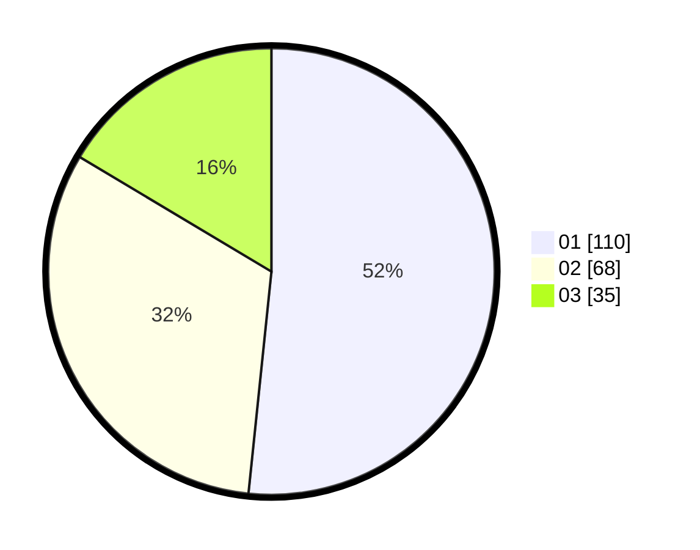

# Hasil

Hasil perolehan suara paslon dapat dilihat pada file paslon-01.txt, paslon-02.txt, dan paslon-03.txt.

Jika tidak ada, artinya data tersebut belum ada pada SIREKAP.

## Perolehan Suara

 * Paslon 01: **110**.
 * Paslon 02: **68**.
 * Paslon 03: **35**.

## Foto C Plano

https://sirekap-obj-formc.kpu.go.id/dd63/pemilu/ppwp/31/71/07/10/01/3171071001006-20240216-175735--555358c5-7c7b-47d5-9581-1db04072fa47.jpg

https://sirekap-obj-formc.kpu.go.id/dd63/pemilu/ppwp/31/71/07/10/01/3171071001006-20240216-175736--3154d3a3-cad1-4468-af00-f31223939544.jpg

https://sirekap-obj-formc.kpu.go.id/dd63/pemilu/ppwp/31/71/07/10/01/3171071001006-20240216-175736--18274bf1-6e21-4150-8c00-184bf7aec303.jpg

## DATA PEMILIH TETAP

Jumlah pemilih dalam DPT: **274**.
 * L: **143**.
 * P: **131**.

## DATA PENGGUNA HAK PILIH

Jumlah pengguna hak pilih dalam DPT: **204**.
 * L: **101**.
 * P: **103**.

Jumlah pengguna hak pilih dalam DPTb: **10**.
 * L: **4**.
 * P: **6**.

Jumlah pengguna hak pilih dalam DPK: **1**.
 * L: **1**.
 * P: **0**.

Jumlah pengguna hak pilih: **215**.
 * L: **106**.
 * P: **109**.

## JUMLAH SUARA SAH DAN TIDAK SAH

JUMLAH SELURUH SUARA SAH: **213**.

JUMLAH SUARA TIDAK SAH: **2**.

JUMLAH SELURUH SUARA SAH DAN SUARA TIDAK SAH: **215**.
