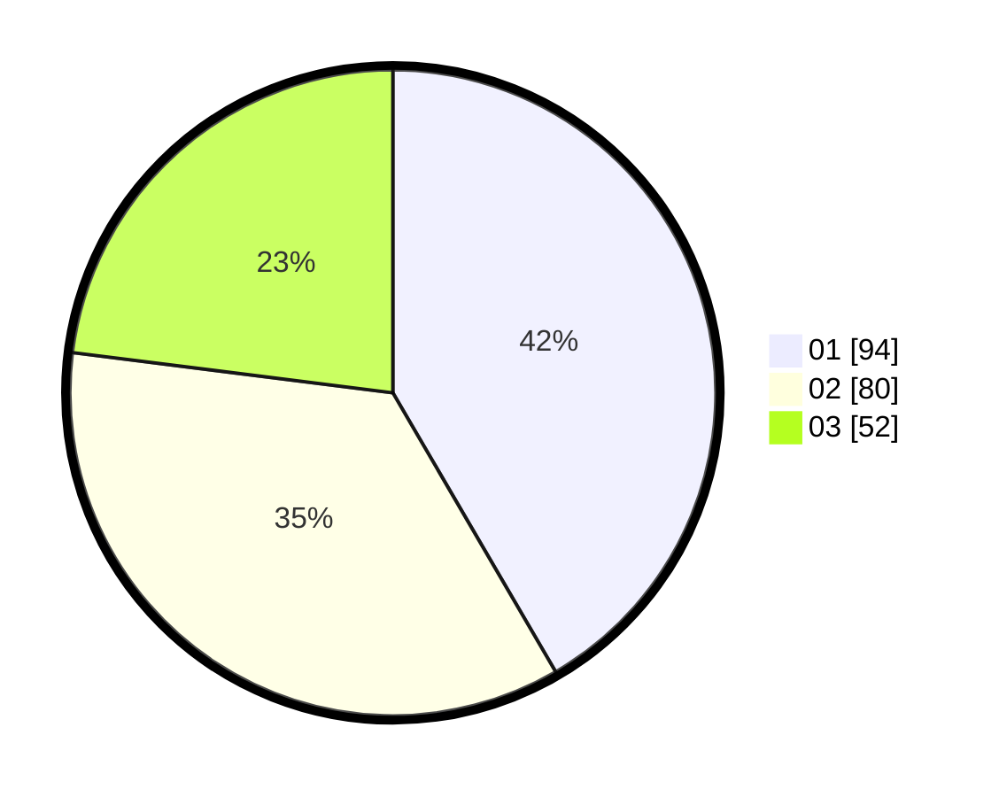

# Hasil

Hasil perolehan suara paslon dapat dilihat pada file paslon-01.txt, paslon-02.txt, dan paslon-03.txt.

Jika tidak ada, artinya data tersebut belum ada pada SIREKAP.

## Perolehan Suara

 * Paslon 01: **94**.
 * Paslon 02: **80**.
 * Paslon 03: **52**.

## Foto C Plano

https://sirekap-obj-formc.kpu.go.id/13bf/pemilu/ppwp/31/71/07/10/01/3171071001008-20240214-211331--db3103ec-d019-4a67-8df5-0fd5eea76e64.jpg

https://sirekap-obj-formc.kpu.go.id/13bf/pemilu/ppwp/31/71/07/10/01/3171071001008-20240216-005352--e765fd1c-acce-477e-94b6-724171386c45.jpg

https://sirekap-obj-formc.kpu.go.id/13bf/pemilu/ppwp/31/71/07/10/01/3171071001008-20240216-005351--83c89f0a-0d6d-489e-a434-2c214bae3d7f.jpg

## DATA PEMILIH TETAP

Jumlah pemilih dalam DPT: **279**.
 * L: **141**.
 * P: **138**.

## DATA PENGGUNA HAK PILIH

Jumlah pengguna hak pilih dalam DPT: **213**.
 * L: **105**.
 * P: **108**.

Jumlah pengguna hak pilih dalam DPTb: **15**.
 * L: **7**.
 * P: **8**.

Jumlah pengguna hak pilih dalam DPK: **1**.
 * L: **1**.
 * P: **0**.

Jumlah pengguna hak pilih: **229**.
 * L: **113**.
 * P: **116**.

## JUMLAH SUARA SAH DAN TIDAK SAH

JUMLAH SELURUH SUARA SAH: **226**.

JUMLAH SUARA TIDAK SAH: **3**.

JUMLAH SELURUH SUARA SAH DAN SUARA TIDAK SAH: **229**.
