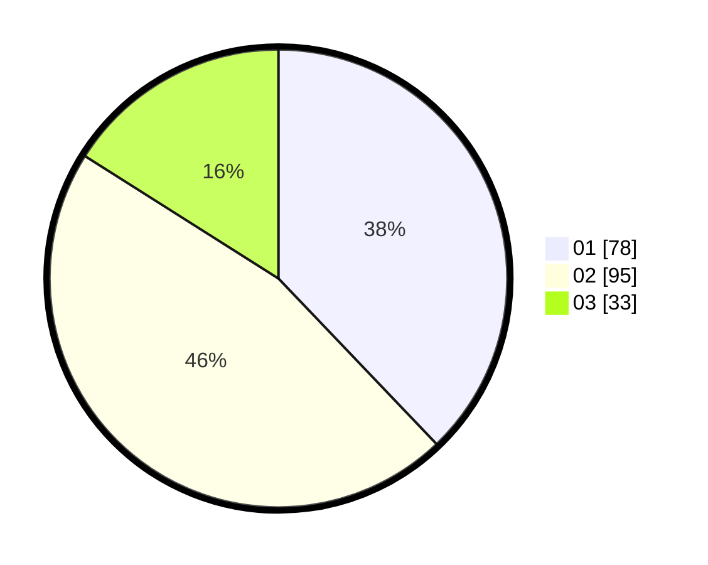

# Hasil

Hasil perolehan suara paslon dapat dilihat pada file paslon-01.txt, paslon-02.txt, dan paslon-03.txt.

Jika tidak ada, artinya data tersebut belum ada pada SIREKAP.

## Perolehan Suara

 * Paslon 01: **78**.
 * Paslon 02: **95**.
 * Paslon 03: **33**.

## Foto C Plano

https://sirekap-obj-formc.kpu.go.id/84dd/pemilu/ppwp/31/71/07/10/01/3171071001010-20240215-002625--dcea1c39-d876-4a5e-9043-75f403b7cbd9.jpg

https://sirekap-obj-formc.kpu.go.id/84dd/pemilu/ppwp/31/71/07/10/01/3171071001010-20240214-191530--f7848c5a-e39d-48fa-a10b-ed5e80d6d5a8.jpg

https://sirekap-obj-formc.kpu.go.id/84dd/pemilu/ppwp/31/71/07/10/01/3171071001010-20240215-002636--1b4322f2-fb29-4ef2-9f8a-abc2a65124fd.jpg

## DATA PEMILIH TETAP

Jumlah pemilih dalam DPT: **249**.
 * L: **117**.
 * P: **132**.

## DATA PENGGUNA HAK PILIH

Jumlah pengguna hak pilih dalam DPT: **196**.
 * L: **91**.
 * P: **105**.

Jumlah pengguna hak pilih dalam DPTb: **9**.
 * L: **4**.
 * P: **5**.

Jumlah pengguna hak pilih dalam DPK: **6**.
 * L: **3**.
 * P: **3**.

Jumlah pengguna hak pilih: **211**.
 * L: **98**.
 * P: **113**.

## JUMLAH SUARA SAH DAN TIDAK SAH

JUMLAH SELURUH SUARA SAH: **206**.

JUMLAH SUARA TIDAK SAH: **5**.

JUMLAH SELURUH SUARA SAH DAN SUARA TIDAK SAH: **211**.
