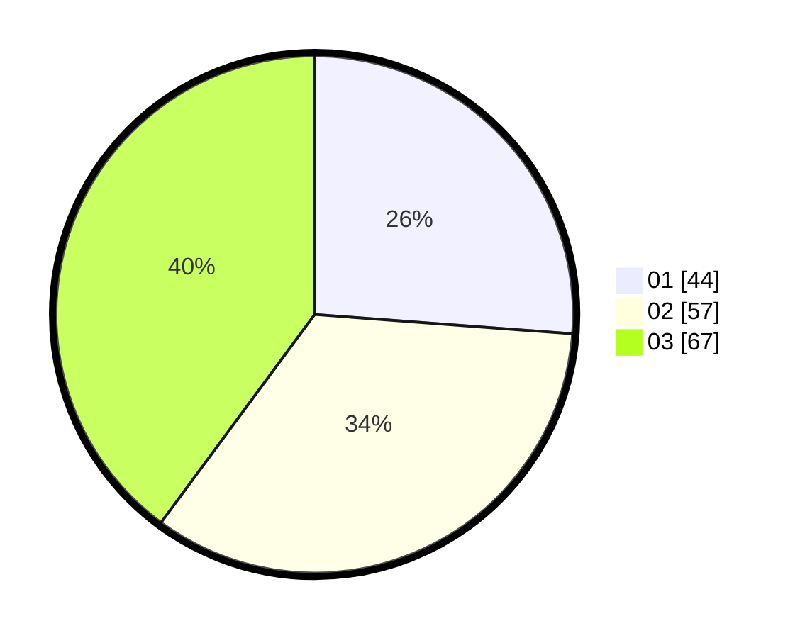

# Hasil

Hasil perolehan suara paslon dapat dilihat pada file paslon-01.txt, paslon-02.txt, dan paslon-03.txt.

Jika tidak ada, artinya data tersebut belum ada pada SIREKAP.

## Perolehan Suara

 * Paslon 01: **44**.
 * Paslon 02: **57**.
 * Paslon 03: **67**.

## Foto C Plano

https://sirekap-obj-formc.kpu.go.id/0abc/pemilu/ppwp/31/71/07/10/02/3171071002001-20240216-164104--04b16d1b-5f34-46f5-a91a-b03995f2f879.jpg

https://sirekap-obj-formc.kpu.go.id/0abc/pemilu/ppwp/31/71/07/10/02/3171071002001-20240216-164126--cde53db7-68ce-4a44-a47f-8ae6250aa1a3.jpg

https://sirekap-obj-formc.kpu.go.id/0abc/pemilu/ppwp/31/71/07/10/02/3171071002001-20240216-164132--61323503-7bf7-45cd-8b2a-d28fd69cbf14.jpg

## DATA PEMILIH TETAP

Jumlah pemilih dalam DPT: **217**.
 * L: **106**.
 * P: **111**.

## DATA PENGGUNA HAK PILIH

Jumlah pengguna hak pilih dalam DPT: **138**.
 * L: **63**.
 * P: **75**.

Jumlah pengguna hak pilih dalam DPTb: **31**.
 * L: **13**.
 * P: **18**.

Jumlah pengguna hak pilih dalam DPK: **0**.
 * L: **0**.
 * P: **0**.

Jumlah pengguna hak pilih: **169**.
 * L: **76**.
 * P: **93**.

## JUMLAH SUARA SAH DAN TIDAK SAH

JUMLAH SELURUH SUARA SAH: **168**.

JUMLAH SUARA TIDAK SAH: **1**.

JUMLAH SELURUH SUARA SAH DAN SUARA TIDAK SAH: **169**.
