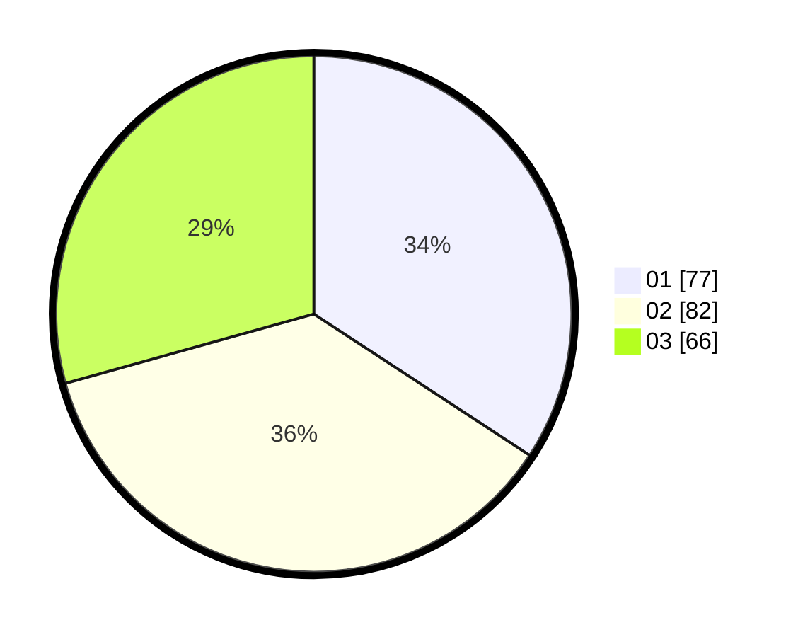

# Hasil

Hasil perolehan suara paslon dapat dilihat pada file paslon-01.txt, paslon-02.txt, dan paslon-03.txt.

Jika tidak ada, artinya data tersebut belum ada pada SIREKAP.

## Perolehan Suara

 * Paslon 01: **77**.
 * Paslon 02: **82**.
 * Paslon 03: **66**.

## Foto C Plano

https://sirekap-obj-formc.kpu.go.id/0aeb/pemilu/ppwp/31/71/07/10/02/3171071002002-20240214-234216--b75410f0-f59f-4785-8467-9c9d1eea83c9.jpg

https://sirekap-obj-formc.kpu.go.id/0aeb/pemilu/ppwp/31/71/07/10/02/3171071002002-20240214-234332--2cdd947f-cbe3-4ff3-a1da-d32e1b9a652e.jpg

https://sirekap-obj-formc.kpu.go.id/0aeb/pemilu/ppwp/31/71/07/10/02/3171071002002-20240214-234446--fb9b5fbf-9034-485f-b074-c3b08306105c.jpg

## DATA PEMILIH TETAP

Jumlah pemilih dalam DPT: **263**.
 * L: **123**.
 * P: **140**.

## DATA PENGGUNA HAK PILIH

Jumlah pengguna hak pilih dalam DPT: **202**.
 * L: **96**.
 * P: **106**.

Jumlah pengguna hak pilih dalam DPTb: **23**.
 * L: **5**.
 * P: **18**.

Jumlah pengguna hak pilih dalam DPK: **4**.
 * L: **1**.
 * P: **3**.

Jumlah pengguna hak pilih: **229**.
 * L: **102**.
 * P: **127**.

## JUMLAH SUARA SAH DAN TIDAK SAH

JUMLAH SELURUH SUARA SAH: **225**.

JUMLAH SUARA TIDAK SAH: **5**.

JUMLAH SELURUH SUARA SAH DAN SUARA TIDAK SAH: **230**.
