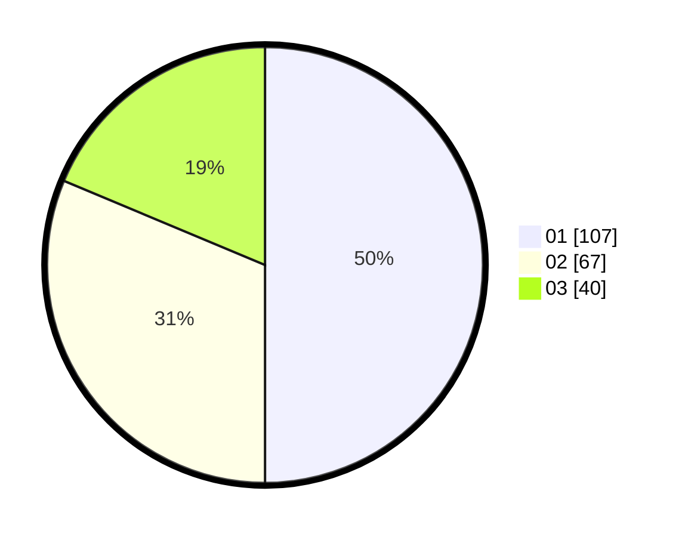

# Hasil

Hasil perolehan suara paslon dapat dilihat pada file paslon-01.txt, paslon-02.txt, dan paslon-03.txt.

Jika tidak ada, artinya data tersebut belum ada pada SIREKAP.

## Perolehan Suara

 * Paslon 01: **107**.
 * Paslon 02: **67**.
 * Paslon 03: **40**.

## Foto C Plano

https://sirekap-obj-formc.kpu.go.id/9253/pemilu/ppwp/31/71/07/10/02/3171071002003-20240216-023725--378f5693-ba39-4a4f-b848-cbcd76573073.jpg

https://sirekap-obj-formc.kpu.go.id/9253/pemilu/ppwp/31/71/07/10/02/3171071002003-20240216-023731--69007594-31a6-4d63-9702-a0a172608d26.jpg

https://sirekap-obj-formc.kpu.go.id/9253/pemilu/ppwp/31/71/07/10/02/3171071002003-20240216-023734--c18711ca-7453-402f-aaa4-ae2aa36e6b75.jpg

## DATA PEMILIH TETAP

Jumlah pemilih dalam DPT: **262**.
 * L: **132**.
 * P: **130**.

## DATA PENGGUNA HAK PILIH

Jumlah pengguna hak pilih dalam DPT: **202**.
 * L: **93**.
 * P: **109**.

Jumlah pengguna hak pilih dalam DPTb: **17**.
 * L: **6**.
 * P: **11**.

Jumlah pengguna hak pilih dalam DPK: **0**.
 * L: **0**.
 * P: **0**.

Jumlah pengguna hak pilih: **219**.
 * L: **99**.
 * P: **120**.

## JUMLAH SUARA SAH DAN TIDAK SAH

JUMLAH SELURUH SUARA SAH: **214**.

JUMLAH SUARA TIDAK SAH: **5**.

JUMLAH SELURUH SUARA SAH DAN SUARA TIDAK SAH: **219**.
