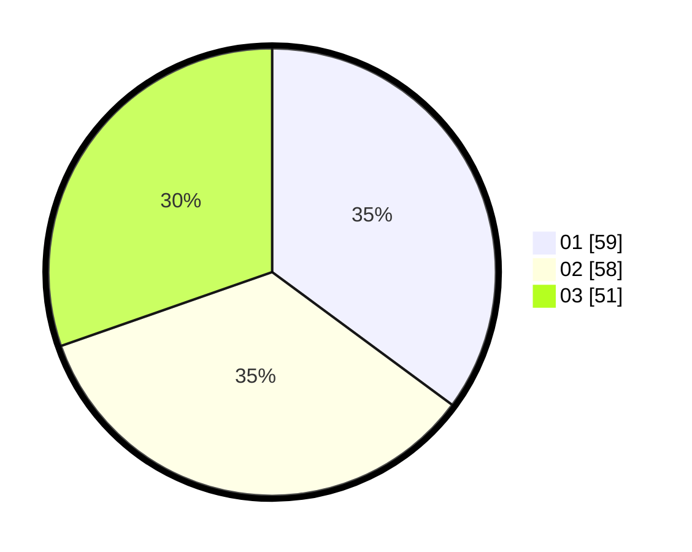

# Hasil

Hasil perolehan suara paslon dapat dilihat pada file paslon-01.txt, paslon-02.txt, dan paslon-03.txt.

Jika tidak ada, artinya data tersebut belum ada pada SIREKAP.

## Perolehan Suara

 * Paslon 01: **59**.
 * Paslon 02: **58**.
 * Paslon 03: **51**.

## Foto C Plano

https://sirekap-obj-formc.kpu.go.id/2ca3/pemilu/ppwp/31/71/07/10/02/3171071002008-20240215-020304--351b8d8f-bb7c-4070-84e7-377c97cf7eb5.jpg

https://sirekap-obj-formc.kpu.go.id/2ca3/pemilu/ppwp/31/71/07/10/02/3171071002008-20240215-015224--03ac78d7-f08a-4815-8fbc-3c7b09d369cb.jpg

https://sirekap-obj-formc.kpu.go.id/2ca3/pemilu/ppwp/31/71/07/10/02/3171071002008-20240215-015335--a6d1b522-fbcd-4497-8c3c-f2d2b0aca77b.jpg

## DATA PEMILIH TETAP

Jumlah pemilih dalam DPT: **247**.
 * L: **114**.
 * P: **133**.

## DATA PENGGUNA HAK PILIH

Jumlah pengguna hak pilih dalam DPT: **184**.
 * L: **86**.
 * P: **98**.

Jumlah pengguna hak pilih dalam DPTb: **14**.
 * L: **3**.
 * P: **11**.

Jumlah pengguna hak pilih dalam DPK: **4**.
 * L: **2**.
 * P: **2**.

Jumlah pengguna hak pilih: **202**.
 * L: **91**.
 * P: **111**.

## JUMLAH SUARA SAH DAN TIDAK SAH

JUMLAH SELURUH SUARA SAH: **168**.

JUMLAH SUARA TIDAK SAH: **34**.

JUMLAH SELURUH SUARA SAH DAN SUARA TIDAK SAH: **202**.
