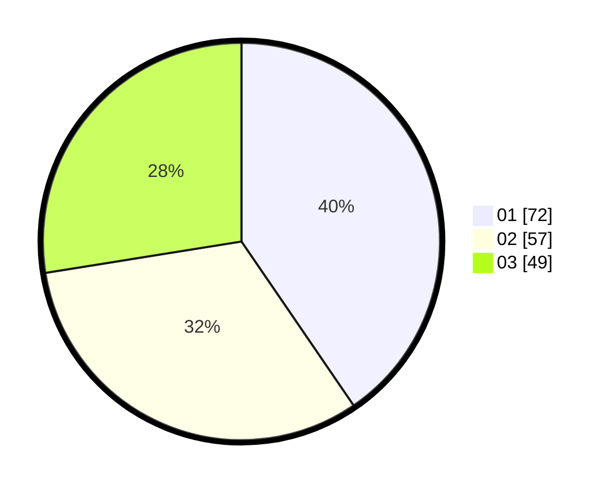

# Hasil

Hasil perolehan suara paslon dapat dilihat pada file paslon-01.txt, paslon-02.txt, dan paslon-03.txt.

Jika tidak ada, artinya data tersebut belum ada pada SIREKAP.

## Perolehan Suara

 * Paslon 01: **72**.
 * Paslon 02: **57**.
 * Paslon 03: **49**.

## Foto C Plano

https://sirekap-obj-formc.kpu.go.id/b644/pemilu/ppwp/31/71/07/10/02/3171071002015-20240216-170259--9a078fb9-dedf-4920-baa7-2ec7d67fa3a0.jpg

https://sirekap-obj-formc.kpu.go.id/b644/pemilu/ppwp/31/71/07/10/02/3171071002015-20240216-170337--304b9414-48f7-4ed1-a907-4f8399b7bdc0.jpg

https://sirekap-obj-formc.kpu.go.id/b644/pemilu/ppwp/31/71/07/10/02/3171071002015-20240216-170423--112190cb-4942-42e8-a027-fa74018756fe.jpg

## DATA PEMILIH TETAP

Jumlah pemilih dalam DPT: **161**.
 * L: **72**.
 * P: **89**.

## DATA PENGGUNA HAK PILIH

Jumlah pengguna hak pilih dalam DPT: **161**.
 * L: **72**.
 * P: **89**.

Jumlah pengguna hak pilih dalam DPTb: **22**.
 * L: **5**.
 * P: **17**.

Jumlah pengguna hak pilih dalam DPK: **0**.
 * L: **0**.
 * P: **0**.

Jumlah pengguna hak pilih: **183**.
 * L: **77**.
 * P: **106**.

## JUMLAH SUARA SAH DAN TIDAK SAH

JUMLAH SELURUH SUARA SAH: **178**.

JUMLAH SUARA TIDAK SAH: **5**.

JUMLAH SELURUH SUARA SAH DAN SUARA TIDAK SAH: **183**.
