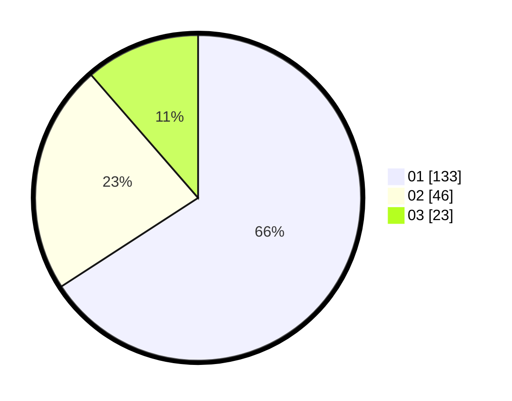

# Hasil

Hasil perolehan suara paslon dapat dilihat pada file paslon-01.txt, paslon-02.txt, dan paslon-03.txt.

Jika tidak ada, artinya data tersebut belum ada pada SIREKAP.

## Perolehan Suara

 * Paslon 01: **133**.
 * Paslon 02: **46**.
 * Paslon 03: **23**.

## Foto C Plano

https://sirekap-obj-formc.kpu.go.id/e8f2/pemilu/ppwp/31/71/07/10/02/3171071002016-20240216-172656--8b017eca-fd94-4d25-9ce2-7e309d3c1628.jpg

https://sirekap-obj-formc.kpu.go.id/e8f2/pemilu/ppwp/31/71/07/10/02/3171071002016-20240216-172706--4fb05593-7223-4848-b8d5-cd46333c2f06.jpg

https://sirekap-obj-formc.kpu.go.id/e8f2/pemilu/ppwp/31/71/07/10/02/3171071002016-20240216-172713--be65d012-0b94-4911-9166-1c5a5e078dba.jpg

## DATA PEMILIH TETAP

Jumlah pemilih dalam DPT: **241**.
 * L: **118**.
 * P: **123**.

## DATA PENGGUNA HAK PILIH

Jumlah pengguna hak pilih dalam DPT: **192**.
 * L: **92**.
 * P: **100**.

Jumlah pengguna hak pilih dalam DPTb: **16**.
 * L: **5**.
 * P: **11**.

Jumlah pengguna hak pilih dalam DPK: **1**.
 * L: **0**.
 * P: **1**.

Jumlah pengguna hak pilih: **209**.
 * L: **97**.
 * P: **112**.

## JUMLAH SUARA SAH DAN TIDAK SAH

JUMLAH SELURUH SUARA SAH: **206**.

JUMLAH SUARA TIDAK SAH: **3**.

JUMLAH SELURUH SUARA SAH DAN SUARA TIDAK SAH: **209**.
