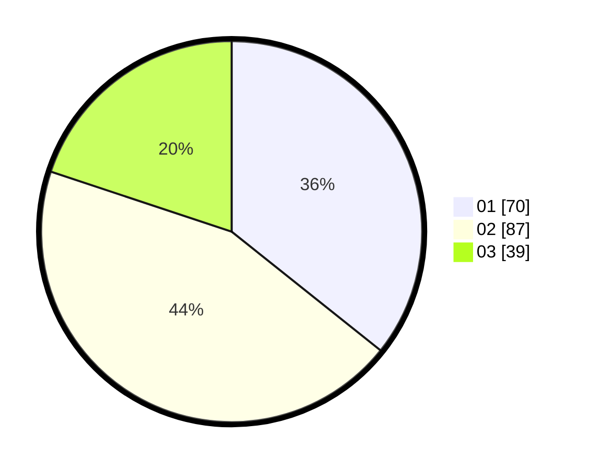

# Hasil

Hasil perolehan suara paslon dapat dilihat pada file paslon-01.txt, paslon-02.txt, dan paslon-03.txt.

Jika tidak ada, artinya data tersebut belum ada pada SIREKAP.

## Perolehan Suara

 * Paslon 01: **70**.
 * Paslon 02: **87**.
 * Paslon 03: **39**.

## Foto C Plano

https://sirekap-obj-formc.kpu.go.id/a8dc/pemilu/ppwp/31/71/07/10/02/3171071002020-20240216-171914--071495f5-e4fc-4464-9eb5-7a05dc8566b0.jpg

https://sirekap-obj-formc.kpu.go.id/a8dc/pemilu/ppwp/31/71/07/10/02/3171071002020-20240216-173612--d2b81ad7-0f79-4863-bcb3-63ee826d298b.jpg
