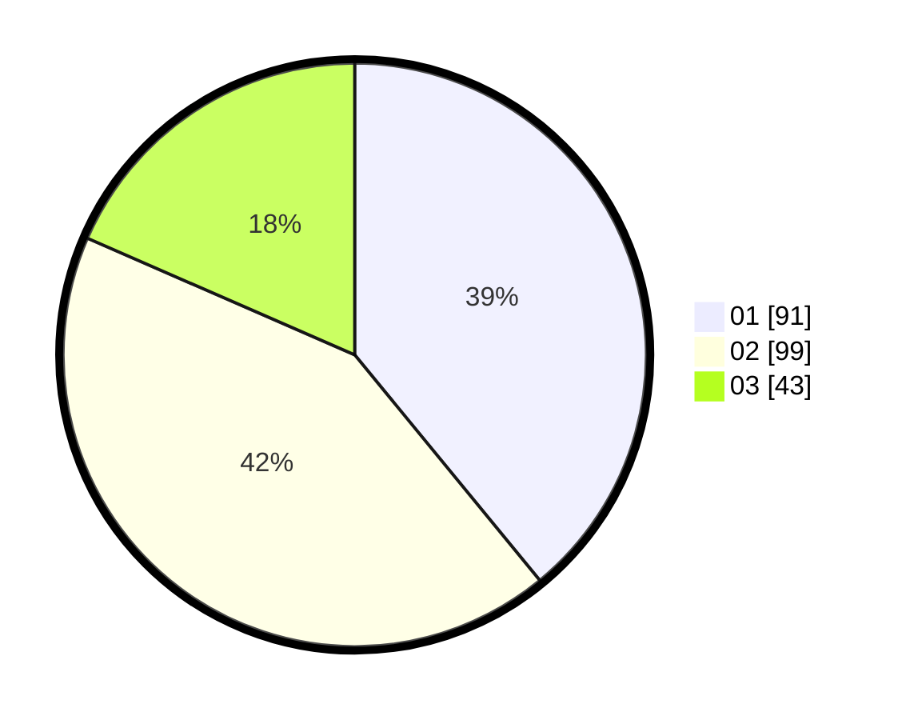

# Hasil

Hasil perolehan suara paslon dapat dilihat pada file paslon-01.txt, paslon-02.txt, dan paslon-03.txt.

Jika tidak ada, artinya data tersebut belum ada pada SIREKAP.

## Perolehan Suara

 * Paslon 01: **91**.
 * Paslon 02: **99**.
 * Paslon 03: **43**.

## Foto C Plano

https://sirekap-obj-formc.kpu.go.id/507d/pemilu/ppwp/31/71/07/10/02/3171071002022-20240214-232950--6d1aef79-9192-4e6d-8a3b-bf75a8076b50.jpg

https://sirekap-obj-formc.kpu.go.id/507d/pemilu/ppwp/31/71/07/10/02/3171071002022-20240214-195428--dc33233e-e946-4cca-8279-2da2d1124d08.jpg

https://sirekap-obj-formc.kpu.go.id/507d/pemilu/ppwp/31/71/07/10/02/3171071002022-20240214-195602--2fe28a49-da00-49a0-bfd6-2731d90e6364.jpg

## DATA PEMILIH TETAP

Jumlah pemilih dalam DPT: **270**.
 * L: **128**.
 * P: **142**.

## DATA PENGGUNA HAK PILIH

Jumlah pengguna hak pilih dalam DPT: **207**.
 * L: **95**.
 * P: **112**.

Jumlah pengguna hak pilih dalam DPTb: **30**.
 * L: **6**.
 * P: **24**.

Jumlah pengguna hak pilih dalam DPK: **2**.
 * L: **1**.
 * P: **1**.

Jumlah pengguna hak pilih: **239**.
 * L: **102**.
 * P: **137**.

## JUMLAH SUARA SAH DAN TIDAK SAH

JUMLAH SELURUH SUARA SAH: **233**.

JUMLAH SUARA TIDAK SAH: **6**.

JUMLAH SELURUH SUARA SAH DAN SUARA TIDAK SAH: **239**.
