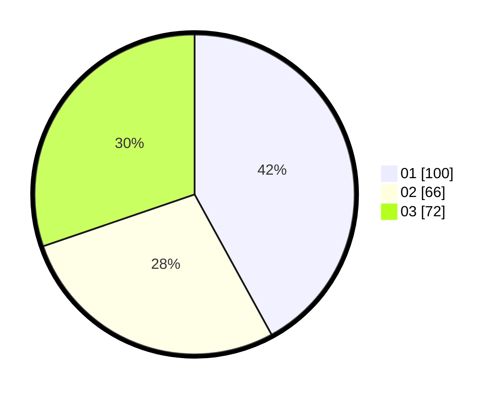

# Hasil

Hasil perolehan suara paslon dapat dilihat pada file paslon-01.txt, paslon-02.txt, dan paslon-03.txt.

Jika tidak ada, artinya data tersebut belum ada pada SIREKAP.

## Perolehan Suara

 * Paslon 01: **100**.
 * Paslon 02: **66**.
 * Paslon 03: **72**.

## Foto C Plano

https://sirekap-obj-formc.kpu.go.id/99aa/pemilu/ppwp/31/71/07/10/02/3171071002023-20240214-215129--2cd0dfff-f599-4d4c-9744-b0e451c322f0.jpg

https://sirekap-obj-formc.kpu.go.id/99aa/pemilu/ppwp/31/71/07/10/02/3171071002023-20240214-215201--865c2c12-6ef1-40d7-905f-8b3eac6e75d0.jpg

https://sirekap-obj-formc.kpu.go.id/99aa/pemilu/ppwp/31/71/07/10/02/3171071002023-20240214-215247--f75a8150-7a2c-402f-89fd-561aeb5e3d41.jpg

## DATA PEMILIH TETAP

Jumlah pemilih dalam DPT: **286**.
 * L: **128**.
 * P: **158**.

## DATA PENGGUNA HAK PILIH

Jumlah pengguna hak pilih dalam DPT: **225**.
 * L: **99**.
 * P: **126**.

Jumlah pengguna hak pilih dalam DPTb: **15**.
 * L: **8**.
 * P: **7**.

Jumlah pengguna hak pilih dalam DPK: **3**.
 * L: **2**.
 * P: **1**.

Jumlah pengguna hak pilih: **243**.
 * L: **119**.
 * P: **134**.

## JUMLAH SUARA SAH DAN TIDAK SAH

JUMLAH SELURUH SUARA SAH: **238**.

JUMLAH SUARA TIDAK SAH: **5**.

JUMLAH SELURUH SUARA SAH DAN SUARA TIDAK SAH: **243**.
