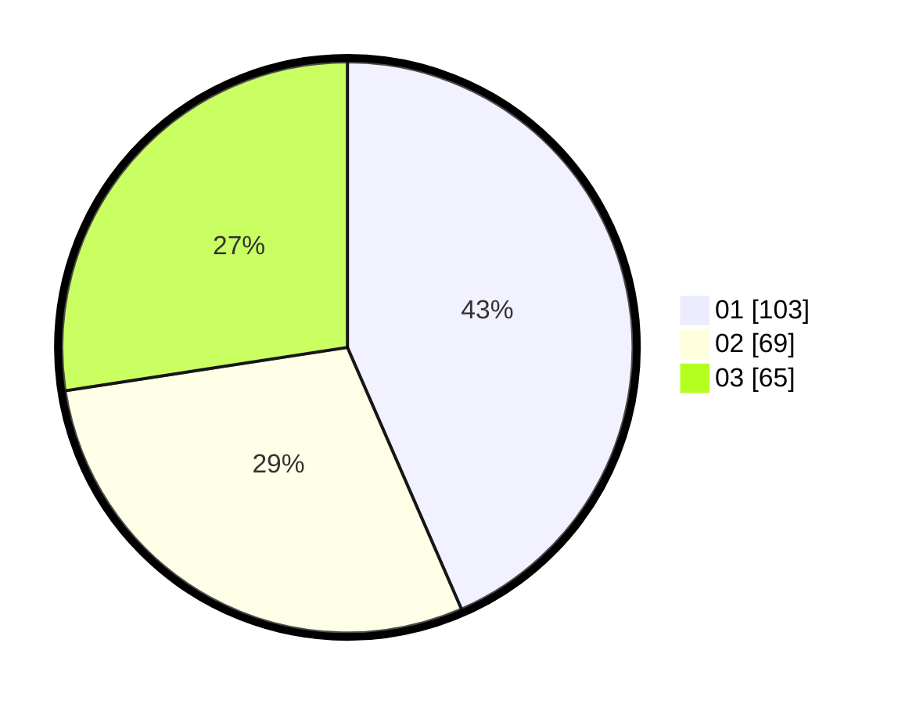

# Hasil

Hasil perolehan suara paslon dapat dilihat pada file paslon-01.txt, paslon-02.txt, dan paslon-03.txt.

Jika tidak ada, artinya data tersebut belum ada pada SIREKAP.

## Perolehan Suara

 * Paslon 01: **103**.
 * Paslon 02: **69**.
 * Paslon 03: **65**.

## Foto C Plano

https://sirekap-obj-formc.kpu.go.id/eaf3/pemilu/ppwp/31/71/07/10/02/3171071002027-20240214-235058--9f6a8a2f-39b7-4dd8-b76e-2df784d0369f.jpg

https://sirekap-obj-formc.kpu.go.id/eaf3/pemilu/ppwp/31/71/07/10/02/3171071002027-20240214-235236--4c0ee208-cf98-4163-9de8-3669a7d43105.jpg

https://sirekap-obj-formc.kpu.go.id/eaf3/pemilu/ppwp/31/71/07/10/02/3171071002027-20240214-235323--a2ed14cf-6c7f-4860-be0a-1cb1b73f6568.jpg

## DATA PEMILIH TETAP

Jumlah pemilih dalam DPT: **277**.
 * L: **141**.
 * P: **136**.

## DATA PENGGUNA HAK PILIH

Jumlah pengguna hak pilih dalam DPT: **213**.
 * L: **110**.
 * P: **103**.

Jumlah pengguna hak pilih dalam DPTb: **23**.
 * L: **6**.
 * P: **17**.

Jumlah pengguna hak pilih dalam DPK: **3**.
 * L: **0**.
 * P: **3**.

Jumlah pengguna hak pilih: **239**.
 * L: **116**.
 * P: **123**.

## JUMLAH SUARA SAH DAN TIDAK SAH

JUMLAH SELURUH SUARA SAH: **237**.

JUMLAH SUARA TIDAK SAH: **2**.

JUMLAH SELURUH SUARA SAH DAN SUARA TIDAK SAH: **239**.
