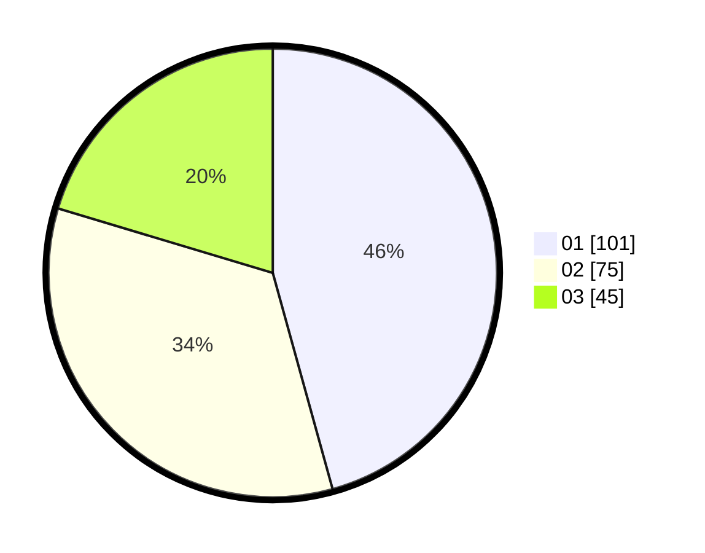

# Hasil

Hasil perolehan suara paslon dapat dilihat pada file paslon-01.txt, paslon-02.txt, dan paslon-03.txt.

Jika tidak ada, artinya data tersebut belum ada pada SIREKAP.

## Perolehan Suara

 * Paslon 01: **101**.
 * Paslon 02: **75**.
 * Paslon 03: **45**.

## Foto C Plano

https://sirekap-obj-formc.kpu.go.id/0ef4/pemilu/ppwp/31/71/07/10/02/3171071002029-20240214-222338--b9455f59-2b4e-4c0b-ac89-335e0e4734f0.jpg

https://sirekap-obj-formc.kpu.go.id/0ef4/pemilu/ppwp/31/71/07/10/02/3171071002029-20240214-222453--8f33cdb7-f183-4f42-8a87-a8b6aa056bdc.jpg

https://sirekap-obj-formc.kpu.go.id/0ef4/pemilu/ppwp/31/71/07/10/02/3171071002029-20240214-222536--67aab925-ec63-47ce-8ed0-e907d3dd2aed.jpg

## DATA PEMILIH TETAP

Jumlah pemilih dalam DPT: **247**.
 * L: **119**.
 * P: **128**.

## DATA PENGGUNA HAK PILIH

Jumlah pengguna hak pilih dalam DPT: **204**.
 * L: **98**.
 * P: **106**.

Jumlah pengguna hak pilih dalam DPTb: **19**.
 * L: **4**.
 * P: **15**.

Jumlah pengguna hak pilih dalam DPK: **5**.
 * L: **3**.
 * P: **2**.

Jumlah pengguna hak pilih: **228**.
 * L: **105**.
 * P: **123**.

## JUMLAH SUARA SAH DAN TIDAK SAH

JUMLAH SELURUH SUARA SAH: **221**.

JUMLAH SUARA TIDAK SAH: **7**.

JUMLAH SELURUH SUARA SAH DAN SUARA TIDAK SAH: **228**.
