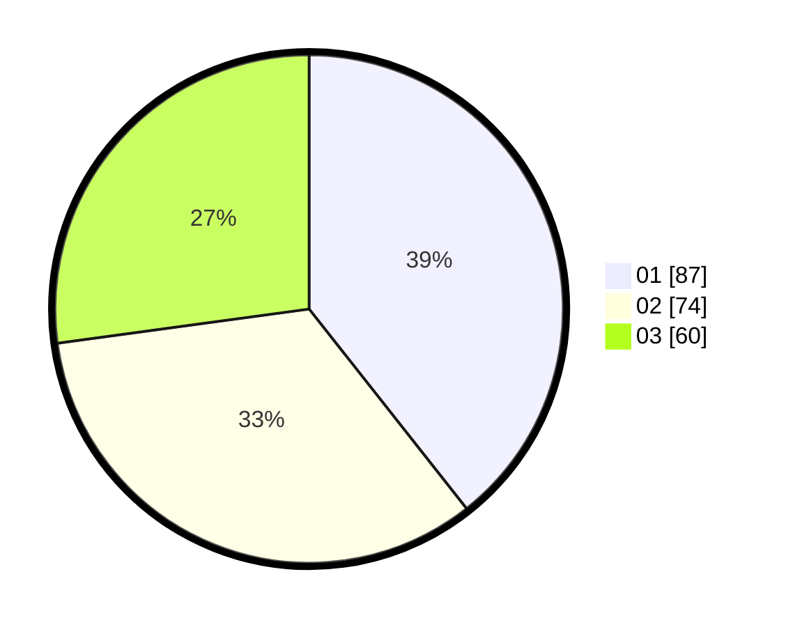

# Hasil

Hasil perolehan suara paslon dapat dilihat pada file paslon-01.txt, paslon-02.txt, dan paslon-03.txt.

Jika tidak ada, artinya data tersebut belum ada pada SIREKAP.

## Perolehan Suara

 * Paslon 01: **87**.
 * Paslon 02: **74**.
 * Paslon 03: **60**.

## Foto C Plano

https://sirekap-obj-formc.kpu.go.id/d465/pemilu/ppwp/31/71/07/10/02/3171071002031-20240216-193224--b34ad7be-fa5b-4b58-8fc5-918fc109d158.jpg

https://sirekap-obj-formc.kpu.go.id/d465/pemilu/ppwp/31/71/07/10/02/3171071002031-20240216-193201--66757764-c8cb-4fc7-b285-e1cdfeb90055.jpg

https://sirekap-obj-formc.kpu.go.id/d465/pemilu/ppwp/31/71/07/10/02/3171071002031-20240214-155859--46d3970c-3b8c-4bd3-923e-8b2e7992806b.jpg

## DATA PEMILIH TETAP

Jumlah pemilih dalam DPT: **254**.
 * L: **116**.
 * P: **138**.

## DATA PENGGUNA HAK PILIH

Jumlah pengguna hak pilih dalam DPT: **205**.
 * L: **91**.
 * P: **114**.

Jumlah pengguna hak pilih dalam DPTb: **14**.
 * L: **2**.
 * P: **12**.

Jumlah pengguna hak pilih dalam DPK: **4**.
 * L: **1**.
 * P: **3**.

Jumlah pengguna hak pilih: **223**.
 * L: **94**.
 * P: **129**.

## JUMLAH SUARA SAH DAN TIDAK SAH

JUMLAH SELURUH SUARA SAH: **221**.

JUMLAH SUARA TIDAK SAH: **2**.

JUMLAH SELURUH SUARA SAH DAN SUARA TIDAK SAH: **223**.
