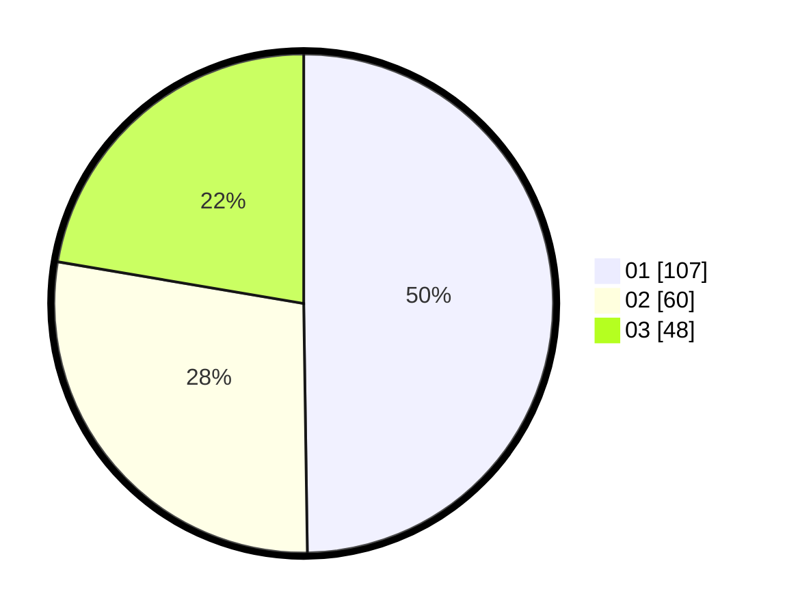

# Hasil

Hasil perolehan suara paslon dapat dilihat pada file paslon-01.txt, paslon-02.txt, dan paslon-03.txt.

Jika tidak ada, artinya data tersebut belum ada pada SIREKAP.

## Perolehan Suara

 * Paslon 01: **107**.
 * Paslon 02: **60**.
 * Paslon 03: **48**.

## Foto C Plano

https://sirekap-obj-formc.kpu.go.id/6c11/pemilu/ppwp/31/71/07/10/02/3171071002036-20240214-192800--0dd570bf-7e7d-4100-b19e-fdcf7bccdcfd.jpg

https://sirekap-obj-formc.kpu.go.id/6c11/pemilu/ppwp/31/71/07/10/02/3171071002036-20240214-225508--88bc01f0-f6c2-4d89-8ee0-223ca50842ef.jpg

https://sirekap-obj-formc.kpu.go.id/6c11/pemilu/ppwp/31/71/07/10/02/3171071002036-20240214-225650--a396427e-bf45-4cb7-ac3c-ff7bb2f1c134.jpg

## DATA PEMILIH TETAP

Jumlah pemilih dalam DPT: **215**.
 * L: **97**.
 * P: **118**.

## DATA PENGGUNA HAK PILIH

Jumlah pengguna hak pilih dalam DPT: **180**.
 * L: **81**.
 * P: **99**.

Jumlah pengguna hak pilih dalam DPTb: **31**.
 * L: **13**.
 * P: **18**.

Jumlah pengguna hak pilih dalam DPK: **4**.
 * L: **3**.
 * P: **1**.

Jumlah pengguna hak pilih: **215**.
 * L: **97**.
 * P: **118**.

## JUMLAH SUARA SAH DAN TIDAK SAH

JUMLAH SELURUH SUARA SAH: **215**.

JUMLAH SUARA TIDAK SAH: **0**.

JUMLAH SELURUH SUARA SAH DAN SUARA TIDAK SAH: **215**.
