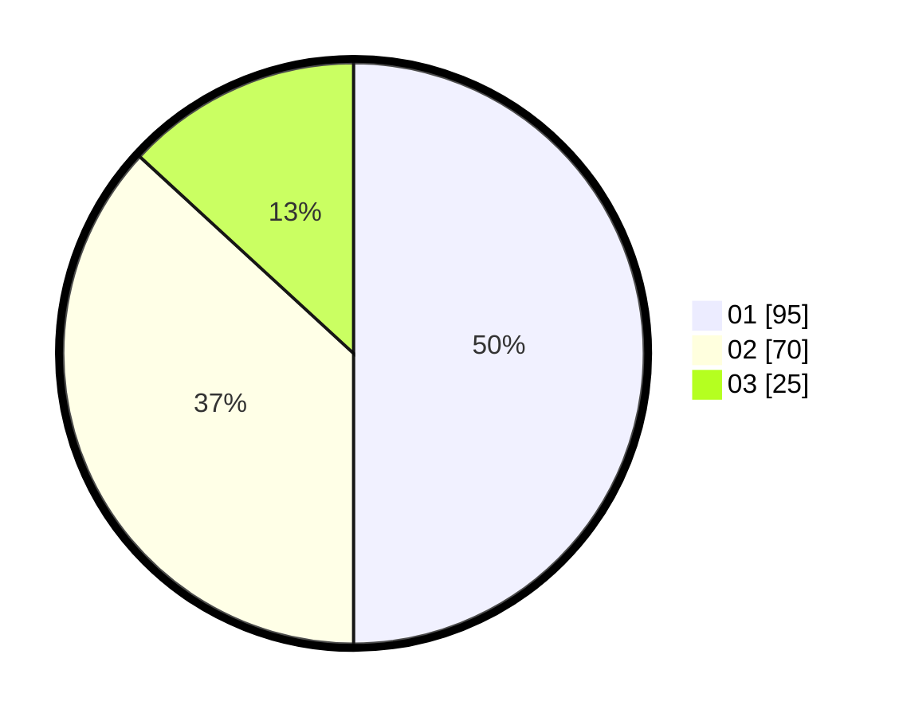

# Hasil

Hasil perolehan suara paslon dapat dilihat pada file paslon-01.txt, paslon-02.txt, dan paslon-03.txt.

Jika tidak ada, artinya data tersebut belum ada pada SIREKAP.

## Perolehan Suara

 * Paslon 01: **95**.
 * Paslon 02: **70**.
 * Paslon 03: **25**.

## Foto C Plano

https://sirekap-obj-formc.kpu.go.id/e19c/pemilu/ppwp/31/71/07/10/02/3171071002037-20240214-162224--d8650231-40a1-4e2d-9951-fb8007d0393a.jpg

https://sirekap-obj-formc.kpu.go.id/e19c/pemilu/ppwp/31/71/07/10/02/3171071002037-20240214-162232--47961f71-0735-4cb7-ae80-33bff159558b.jpg

https://sirekap-obj-formc.kpu.go.id/e19c/pemilu/ppwp/31/71/07/10/02/3171071002037-20240214-185454--b421a4e6-ed7f-4936-9726-348aeab0210f.jpg

## DATA PEMILIH TETAP

Jumlah pemilih dalam DPT: **214**.
 * L: **97**.
 * P: **117**.

## DATA PENGGUNA HAK PILIH

Jumlah pengguna hak pilih dalam DPT: **164**.
 * L: **73**.
 * P: **91**.

Jumlah pengguna hak pilih dalam DPTb: **29**.
 * L: **18**.
 * P: **11**.

Jumlah pengguna hak pilih dalam DPK: **0**.
 * L: **0**.
 * P: **0**.

Jumlah pengguna hak pilih: **193**.
 * L: **91**.
 * P: **102**.

## JUMLAH SUARA SAH DAN TIDAK SAH

JUMLAH SELURUH SUARA SAH: **190**.

JUMLAH SUARA TIDAK SAH: **2**.

JUMLAH SELURUH SUARA SAH DAN SUARA TIDAK SAH: **192**.
