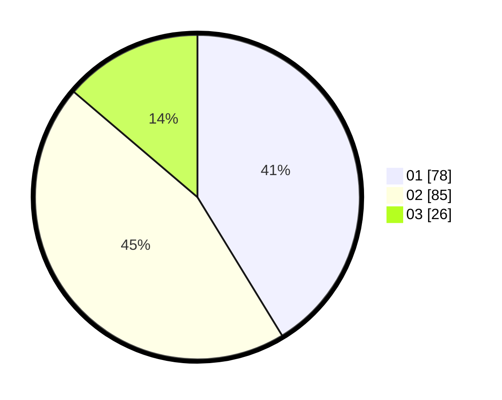

# Hasil

Hasil perolehan suara paslon dapat dilihat pada file paslon-01.txt, paslon-02.txt, dan paslon-03.txt.

Jika tidak ada, artinya data tersebut belum ada pada SIREKAP.

## Perolehan Suara

 * Paslon 01: **78**.
 * Paslon 02: **85**.
 * Paslon 03: **26**.

## Foto C Plano

https://sirekap-obj-formc.kpu.go.id/7485/pemilu/ppwp/31/71/07/10/02/3171071002041-20240215-163412--06b9666e-1096-45bb-821e-a39cbd7f687d.jpg

https://sirekap-obj-formc.kpu.go.id/7485/pemilu/ppwp/31/71/07/10/02/3171071002041-20240215-163428--250243b0-de2a-4785-9730-ff92f806cc8c.jpg

https://sirekap-obj-formc.kpu.go.id/7485/pemilu/ppwp/31/71/07/10/02/3171071002041-20240215-163430--35f0f63c-d45e-4693-a857-817bee4c7a69.jpg

## DATA PEMILIH TETAP

Jumlah pemilih dalam DPT: **242**.
 * L: **131**.
 * P: **111**.

## DATA PENGGUNA HAK PILIH

Jumlah pengguna hak pilih dalam DPT: **176**.
 * L: **97**.
 * P: **79**.

Jumlah pengguna hak pilih dalam DPTb: **12**.
 * L: **4**.
 * P: **8**.

Jumlah pengguna hak pilih dalam DPK: **3**.
 * L: **2**.
 * P: **1**.

Jumlah pengguna hak pilih: **191**.
 * L: **103**.
 * P: **88**.

## JUMLAH SUARA SAH DAN TIDAK SAH

JUMLAH SELURUH SUARA SAH: **189**.

JUMLAH SUARA TIDAK SAH: **2**.

JUMLAH SELURUH SUARA SAH DAN SUARA TIDAK SAH: **191**.
