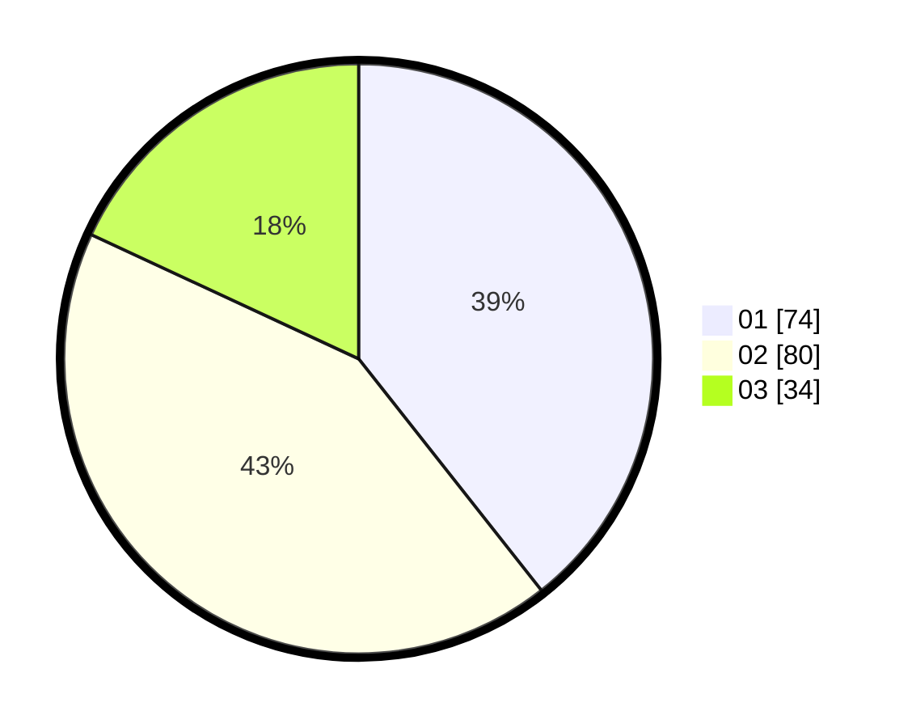

# Hasil

Hasil perolehan suara paslon dapat dilihat pada file paslon-01.txt, paslon-02.txt, dan paslon-03.txt.

Jika tidak ada, artinya data tersebut belum ada pada SIREKAP.

## Perolehan Suara

 * Paslon 01: **74**.
 * Paslon 02: **80**.
 * Paslon 03: **34**.

## Foto C Plano

https://sirekap-obj-formc.kpu.go.id/7c40/pemilu/ppwp/31/71/07/10/02/3171071002042-20240216-163124--e158197f-7067-4a0e-97cc-59adc1bc0c99.jpg

https://sirekap-obj-formc.kpu.go.id/7c40/pemilu/ppwp/31/71/07/10/02/3171071002042-20240216-145159--e192571b-4b84-4521-a211-e4f843b7f288.jpg

https://sirekap-obj-formc.kpu.go.id/7c40/pemilu/ppwp/31/71/07/10/02/3171071002042-20240214-155812--4e399103-be20-4411-832d-cee516c8cfc3.jpg

## DATA PEMILIH TETAP

Jumlah pemilih dalam DPT: **241**.
 * L: **124**.
 * P: **117**.

## DATA PENGGUNA HAK PILIH

Jumlah pengguna hak pilih dalam DPT: **171**.
 * L: **87**.
 * P: **84**.

Jumlah pengguna hak pilih dalam DPTb: **16**.
 * L: **10**.
 * P: **6**.

Jumlah pengguna hak pilih dalam DPK: **2**.
 * L: **1**.
 * P: **1**.

Jumlah pengguna hak pilih: **189**.
 * L: **98**.
 * P: **91**.

## JUMLAH SUARA SAH DAN TIDAK SAH

JUMLAH SELURUH SUARA SAH: **188**.

JUMLAH SUARA TIDAK SAH: **1**.

JUMLAH SELURUH SUARA SAH DAN SUARA TIDAK SAH: **189**.
