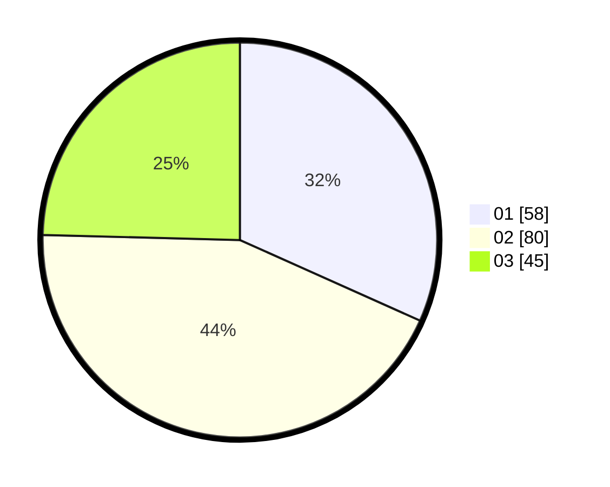

# Hasil

Hasil perolehan suara paslon dapat dilihat pada file paslon-01.txt, paslon-02.txt, dan paslon-03.txt.

Jika tidak ada, artinya data tersebut belum ada pada SIREKAP.

## Perolehan Suara

 * Paslon 01: **58**.
 * Paslon 02: **80**.
 * Paslon 03: **45**.

## Foto C Plano

https://sirekap-obj-formc.kpu.go.id/1f48/pemilu/ppwp/31/71/07/10/02/3171071002044-20240217-004930--1cd74537-a51f-4570-8064-d92a2bfbed52.jpg

https://sirekap-obj-formc.kpu.go.id/1f48/pemilu/ppwp/31/71/07/10/02/3171071002044-20240217-005541--73d1f3d9-a697-47d6-9b6a-24b2715ccec7.jpg

https://sirekap-obj-formc.kpu.go.id/1f48/pemilu/ppwp/31/71/07/10/02/3171071002044-20240217-010043--d8f3276d-d039-47f5-ae2c-74fe5454ddd7.jpg

## DATA PEMILIH TETAP

Jumlah pemilih dalam DPT: **234**.
 * L: **119**.
 * P: **115**.

## DATA PENGGUNA HAK PILIH

Jumlah pengguna hak pilih dalam DPT: **177**.
 * L: **87**.
 * P: **90**.

Jumlah pengguna hak pilih dalam DPTb: **6**.
 * L: **3**.
 * P: **3**.

Jumlah pengguna hak pilih dalam DPK: **2**.
 * L: **0**.
 * P: **2**.

Jumlah pengguna hak pilih: **185**.
 * L: **90**.
 * P: **95**.

## JUMLAH SUARA SAH DAN TIDAK SAH

JUMLAH SELURUH SUARA SAH: **183**.

JUMLAH SUARA TIDAK SAH: **2**.

JUMLAH SELURUH SUARA SAH DAN SUARA TIDAK SAH: **185**.
