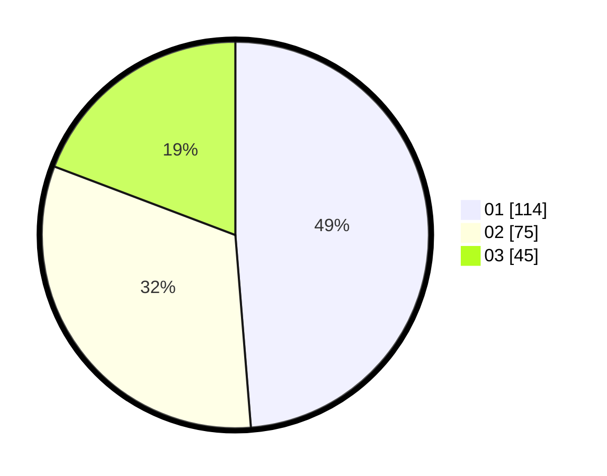

# Hasil

Hasil perolehan suara paslon dapat dilihat pada file paslon-01.txt, paslon-02.txt, dan paslon-03.txt.

Jika tidak ada, artinya data tersebut belum ada pada SIREKAP.

## Perolehan Suara

 * Paslon 01: **114**.
 * Paslon 02: **75**.
 * Paslon 03: **45**.

## Foto C Plano

https://sirekap-obj-formc.kpu.go.id/8df3/pemilu/ppwp/31/71/07/10/02/3171071002048-20240217-174919--8d0d9476-b58b-4b22-b1ff-a07fa81bf330.jpg

https://sirekap-obj-formc.kpu.go.id/8df3/pemilu/ppwp/31/71/07/10/02/3171071002048-20240217-181811--212af604-f1e0-43de-97ba-a05e97c0f88a.jpg

https://sirekap-obj-formc.kpu.go.id/8df3/pemilu/ppwp/31/71/07/10/02/3171071002048-20240217-181002--48fe3567-5936-49d5-81ff-1ef6a2c4e4d2.jpg

## DATA PEMILIH TETAP

Jumlah pemilih dalam DPT: **270**.
 * L: **122**.
 * P: **148**.

## DATA PENGGUNA HAK PILIH

Jumlah pengguna hak pilih dalam DPT: **217**.
 * L: **99**.
 * P: **118**.

Jumlah pengguna hak pilih dalam DPTb: **19**.
 * L: **5**.
 * P: **14**.

Jumlah pengguna hak pilih dalam DPK: **2**.
 * L: **0**.
 * P: **2**.

Jumlah pengguna hak pilih: **238**.
 * L: **104**.
 * P: **134**.

## JUMLAH SUARA SAH DAN TIDAK SAH

JUMLAH SELURUH SUARA SAH: **234**.

JUMLAH SUARA TIDAK SAH: **4**.

JUMLAH SELURUH SUARA SAH DAN SUARA TIDAK SAH: **238**.
