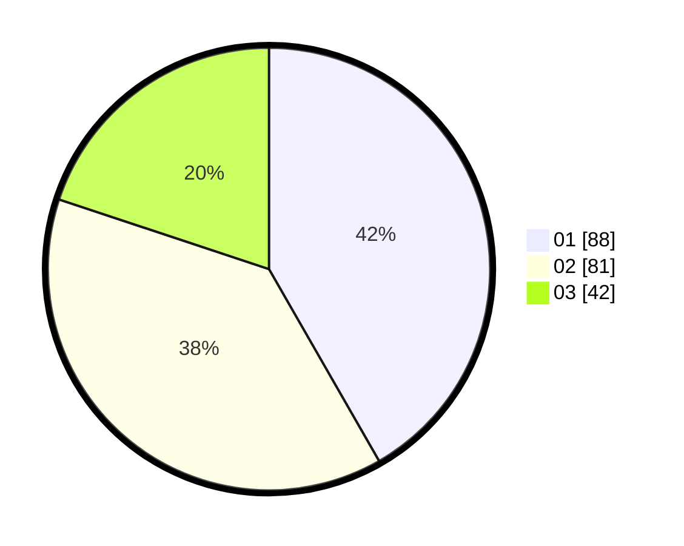

# Hasil

Hasil perolehan suara paslon dapat dilihat pada file paslon-01.txt, paslon-02.txt, dan paslon-03.txt.

Jika tidak ada, artinya data tersebut belum ada pada SIREKAP.

## Perolehan Suara

 * Paslon 01: **88**.
 * Paslon 02: **81**.
 * Paslon 03: **42**.

## Foto C Plano

https://sirekap-obj-formc.kpu.go.id/c327/pemilu/ppwp/31/71/07/10/02/3171071002050-20240215-002825--6fd403fa-6fa1-45a0-9eb5-4e2bfac33cbd.jpg

https://sirekap-obj-formc.kpu.go.id/c327/pemilu/ppwp/31/71/07/10/02/3171071002050-20240215-002934--6fa20333-ba4d-4244-90b0-f72a78980530.jpg

https://sirekap-obj-formc.kpu.go.id/c327/pemilu/ppwp/31/71/07/10/02/3171071002050-20240215-003206--dfc0bde3-0efb-4ca5-bcb5-26c7a1073de6.jpg

## DATA PEMILIH TETAP

Jumlah pemilih dalam DPT: **268**.
 * L: **123**.
 * P: **145**.

## DATA PENGGUNA HAK PILIH

Jumlah pengguna hak pilih dalam DPT: **194**.
 * L: **84**.
 * P: **110**.

Jumlah pengguna hak pilih dalam DPTb: **14**.
 * L: **8**.
 * P: **6**.

Jumlah pengguna hak pilih dalam DPK: **4**.
 * L: **3**.
 * P: **1**.

Jumlah pengguna hak pilih: **212**.
 * L: **95**.
 * P: **117**.

## JUMLAH SUARA SAH DAN TIDAK SAH

JUMLAH SELURUH SUARA SAH: **211**.

JUMLAH SUARA TIDAK SAH: **1**.

JUMLAH SELURUH SUARA SAH DAN SUARA TIDAK SAH: **212**.
