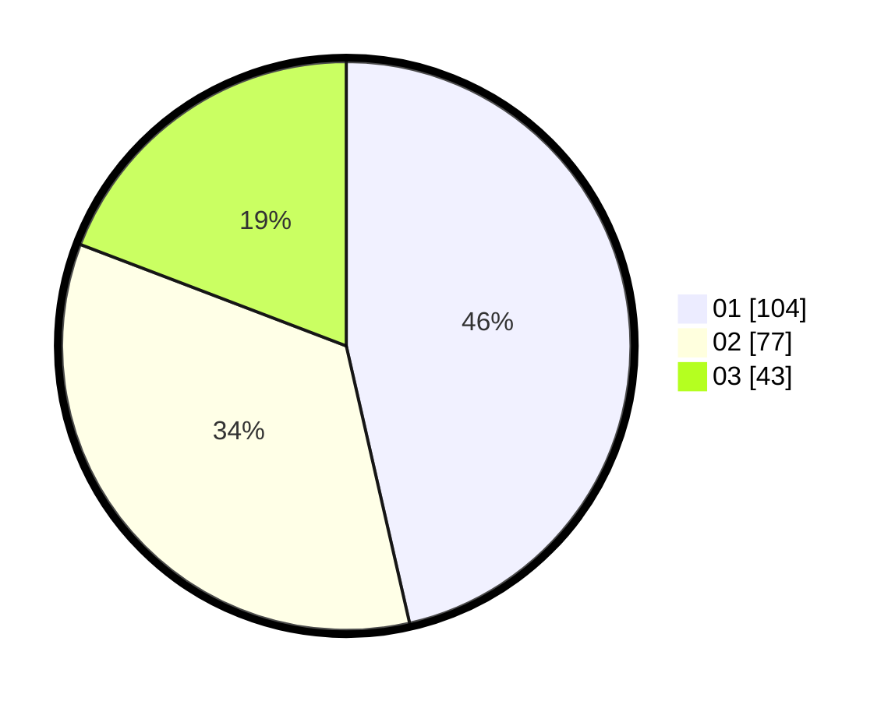

# Hasil

Hasil perolehan suara paslon dapat dilihat pada file paslon-01.txt, paslon-02.txt, dan paslon-03.txt.

Jika tidak ada, artinya data tersebut belum ada pada SIREKAP.

## Perolehan Suara

 * Paslon 01: **104**.
 * Paslon 02: **77**.
 * Paslon 03: **43**.

## Foto C Plano

https://sirekap-obj-formc.kpu.go.id/5a18/pemilu/ppwp/31/71/07/10/02/3171071002051-20240216-174038--838ac2e2-1d1b-4620-8061-f2c7b62b1618.jpg

https://sirekap-obj-formc.kpu.go.id/5a18/pemilu/ppwp/31/71/07/10/02/3171071002051-20240216-174142--991a811b-a206-4416-bbd7-bb60e2a3aa39.jpg

https://sirekap-obj-formc.kpu.go.id/5a18/pemilu/ppwp/31/71/07/10/02/3171071002051-20240216-174204--2db46924-ca2f-44f9-88de-7bc94d75b1f9.jpg

## DATA PEMILIH TETAP

Jumlah pemilih dalam DPT: **282**.
 * L: **140**.
 * P: **142**.

## DATA PENGGUNA HAK PILIH

Jumlah pengguna hak pilih dalam DPT: **213**.
 * L: **102**.
 * P: **111**.

Jumlah pengguna hak pilih dalam DPTb: **8**.
 * L: **2**.
 * P: **6**.

Jumlah pengguna hak pilih dalam DPK: **0**.
 * L: **0**.
 * P: **0**.

Jumlah pengguna hak pilih: **227**.
 * L: **109**.
 * P: **118**.

## JUMLAH SUARA SAH DAN TIDAK SAH

JUMLAH SELURUH SUARA SAH: **224**.

JUMLAH SUARA TIDAK SAH: **3**.

JUMLAH SELURUH SUARA SAH DAN SUARA TIDAK SAH: **227**.
