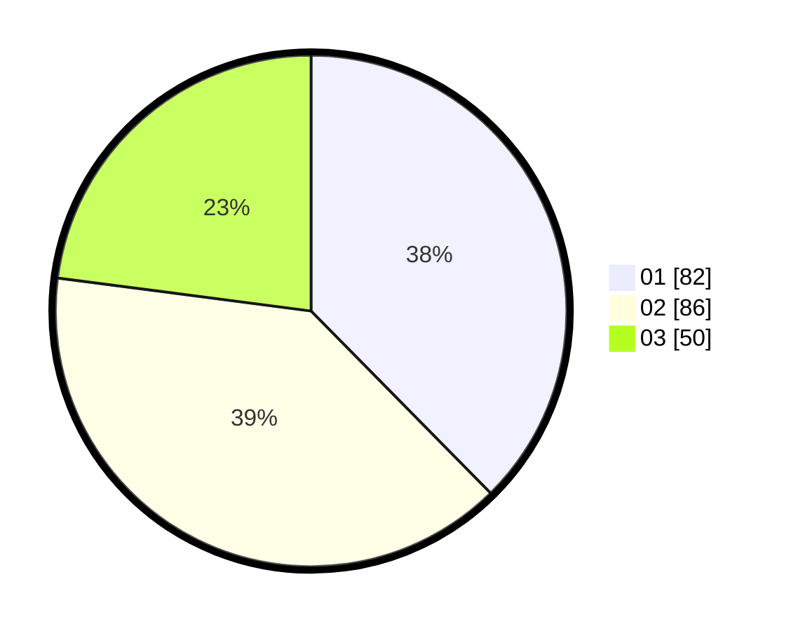

# Hasil

Hasil perolehan suara paslon dapat dilihat pada file paslon-01.txt, paslon-02.txt, dan paslon-03.txt.

Jika tidak ada, artinya data tersebut belum ada pada SIREKAP.

## Perolehan Suara

 * Paslon 01: **82**.
 * Paslon 02: **86**.
 * Paslon 03: **50**.

## Foto C Plano

https://sirekap-obj-formc.kpu.go.id/7108/pemilu/ppwp/31/71/07/10/02/3171071002052-20240214-185920--b5b6cad6-83ae-40fe-af5e-0d3ebb2d0589.jpg

https://sirekap-obj-formc.kpu.go.id/7108/pemilu/ppwp/31/71/07/10/02/3171071002052-20240214-190229--9f3c8e85-8c48-4821-a327-a8d2ebf7dfd7.jpg

https://sirekap-obj-formc.kpu.go.id/7108/pemilu/ppwp/31/71/07/10/02/3171071002052-20240214-191401--c7330d3b-e087-494c-b363-0ec5ca956899.jpg

## DATA PEMILIH TETAP

Jumlah pemilih dalam DPT: **279**.
 * L: **139**.
 * P: **140**.

## DATA PENGGUNA HAK PILIH

Jumlah pengguna hak pilih dalam DPT: **199**.
 * L: **94**.
 * P: **105**.

Jumlah pengguna hak pilih dalam DPTb: **14**.
 * L: **3**.
 * P: **11**.

Jumlah pengguna hak pilih dalam DPK: **8**.
 * L: **3**.
 * P: **5**.

Jumlah pengguna hak pilih: **221**.
 * L: **100**.
 * P: **121**.

## JUMLAH SUARA SAH DAN TIDAK SAH

JUMLAH SELURUH SUARA SAH: **218**.

JUMLAH SUARA TIDAK SAH: **3**.

JUMLAH SELURUH SUARA SAH DAN SUARA TIDAK SAH: **221**.
