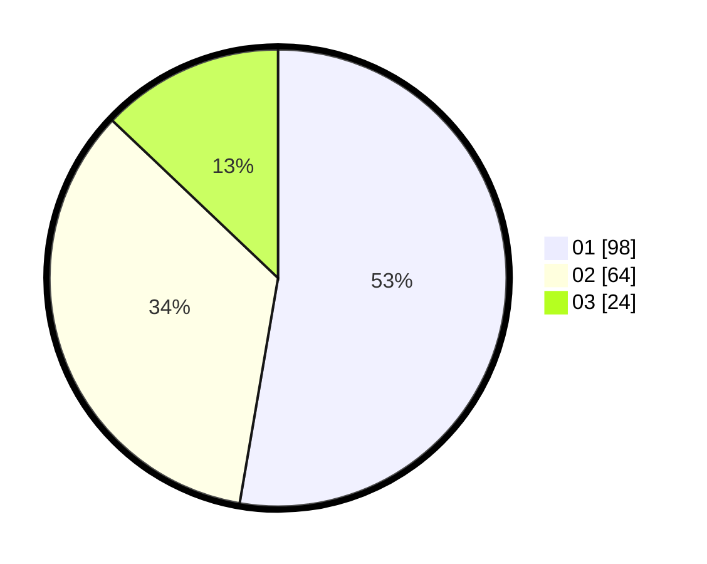

# Hasil

Hasil perolehan suara paslon dapat dilihat pada file paslon-01.txt, paslon-02.txt, dan paslon-03.txt.

Jika tidak ada, artinya data tersebut belum ada pada SIREKAP.

## Perolehan Suara

 * Paslon 01: **98**.
 * Paslon 02: **64**.
 * Paslon 03: **24**.

## Foto C Plano

https://sirekap-obj-formc.kpu.go.id/ab44/pemilu/ppwp/31/71/07/10/02/3171071002055-20240214-222216--ee5c0d2b-e50e-4394-8dfe-595f3ff859e8.jpg

https://sirekap-obj-formc.kpu.go.id/ab44/pemilu/ppwp/31/71/07/10/02/3171071002055-20240214-222408--8c3c25e9-b7a0-4552-87d4-6bdd5091504e.jpg

https://sirekap-obj-formc.kpu.go.id/ab44/pemilu/ppwp/31/71/07/10/02/3171071002055-20240214-222528--9b41deb7-05d2-4ec1-aa26-c036c03f2aa2.jpg

## DATA PEMILIH TETAP

Jumlah pemilih dalam DPT: **277**.
 * L: **134**.
 * P: **143**.

## DATA PENGGUNA HAK PILIH

Jumlah pengguna hak pilih dalam DPT: **173**.
 * L: **0**.
 * P: **0**.

Jumlah pengguna hak pilih dalam DPTb: **12**.
 * L: **0**.
 * P: **0**.

Jumlah pengguna hak pilih dalam DPK: **0**.
 * L: **0**.
 * P: **0**.

Jumlah pengguna hak pilih: **185**.
 * L: **0**.
 * P: **0**.

## JUMLAH SUARA SAH DAN TIDAK SAH

JUMLAH SELURUH SUARA SAH: **185**.

JUMLAH SUARA TIDAK SAH: **0**.

JUMLAH SELURUH SUARA SAH DAN SUARA TIDAK SAH: **185**.
