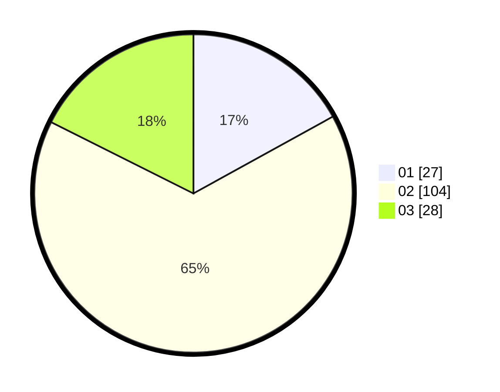

# Hasil

Hasil perolehan suara paslon dapat dilihat pada file paslon-01.txt, paslon-02.txt, dan paslon-03.txt.

Jika tidak ada, artinya data tersebut belum ada pada SIREKAP.

## Perolehan Suara

 * Paslon 01: **27**.
 * Paslon 02: **104**.
 * Paslon 03: **28**.

## Foto C Plano

https://sirekap-obj-formc.kpu.go.id/84f4/pemilu/ppwp/31/71/07/10/02/3171071002059-20240218-083347--f9b63760-ce6f-4a26-97ce-c5e54fce8942.jpg

https://sirekap-obj-formc.kpu.go.id/84f4/pemilu/ppwp/31/71/07/10/02/3171071002059-20240218-083456--8167fe36-23b0-43df-a895-b81118b02d29.jpg

https://sirekap-obj-formc.kpu.go.id/84f4/pemilu/ppwp/31/71/07/10/02/3171071002059-20240218-083605--09578641-1a06-4712-9b9a-e30f16eb0f2f.jpg

## DATA PEMILIH TETAP

Jumlah pemilih dalam DPT: **269**.
 * L: **730**.
 * P: **639**.

## DATA PENGGUNA HAK PILIH

Jumlah pengguna hak pilih dalam DPT: **160**.
 * L: **65**.
 * P: **895**.

Jumlah pengguna hak pilih dalam DPTb: **10**.
 * L: **5**.
 * P: **5**.

Jumlah pengguna hak pilih dalam DPK: **2**.
 * L: **2**.
 * P: **0**.

Jumlah pengguna hak pilih: **172**.
 * L: **72**.
 * P: **500**.

## JUMLAH SUARA SAH DAN TIDAK SAH

JUMLAH SELURUH SUARA SAH: **169**.

JUMLAH SUARA TIDAK SAH: **3**.

JUMLAH SELURUH SUARA SAH DAN SUARA TIDAK SAH: **172**.
