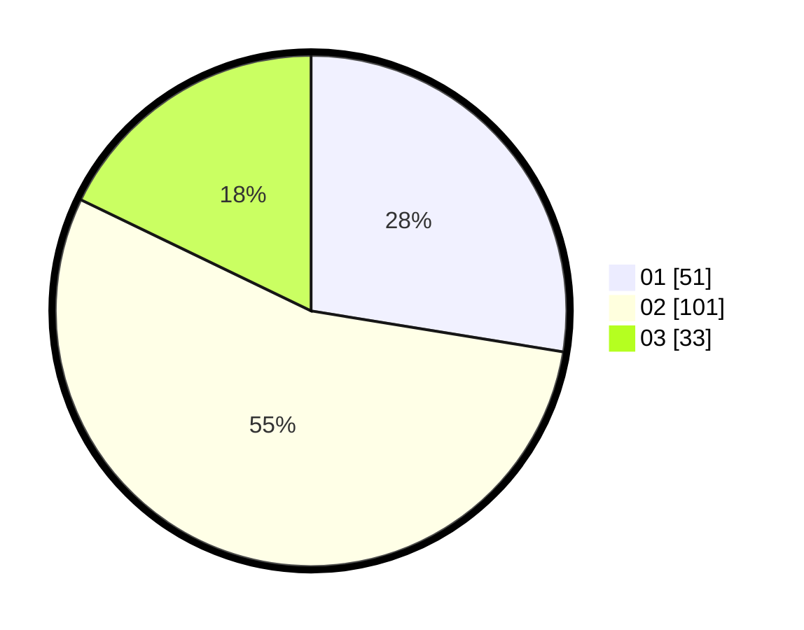

# Hasil

Hasil perolehan suara paslon dapat dilihat pada file paslon-01.txt, paslon-02.txt, dan paslon-03.txt.

Jika tidak ada, artinya data tersebut belum ada pada SIREKAP.

## Perolehan Suara

 * Paslon 01: **51**.
 * Paslon 02: **101**.
 * Paslon 03: **33**.

## Foto C Plano

https://sirekap-obj-formc.kpu.go.id/2122/pemilu/ppwp/31/71/07/10/02/3171071002065-20240214-214807--a3a1b789-e9ba-46e9-9612-72d71912245c.jpg

https://sirekap-obj-formc.kpu.go.id/2122/pemilu/ppwp/31/71/07/10/02/3171071002065-20240214-213541--0c6c0720-eb45-4ab4-917b-571db365f198.jpg

https://sirekap-obj-formc.kpu.go.id/2122/pemilu/ppwp/31/71/07/10/02/3171071002065-20240214-213734--faa8656c-ad57-4617-bba7-20c0c6469743.jpg

## DATA PEMILIH TETAP

Jumlah pemilih dalam DPT: **282**.
 * L: **153**.
 * P: **129**.

## DATA PENGGUNA HAK PILIH

Jumlah pengguna hak pilih dalam DPT: **185**.
 * L: **94**.
 * P: **91**.

Jumlah pengguna hak pilih dalam DPTb: **5**.
 * L: **2**.
 * P: **3**.

Jumlah pengguna hak pilih dalam DPK: **0**.
 * L: **0**.
 * P: **0**.

Jumlah pengguna hak pilih: **190**.
 * L: **96**.
 * P: **94**.

## JUMLAH SUARA SAH DAN TIDAK SAH

JUMLAH SELURUH SUARA SAH: **185**.

JUMLAH SUARA TIDAK SAH: **5**.

JUMLAH SELURUH SUARA SAH DAN SUARA TIDAK SAH: **190**.
