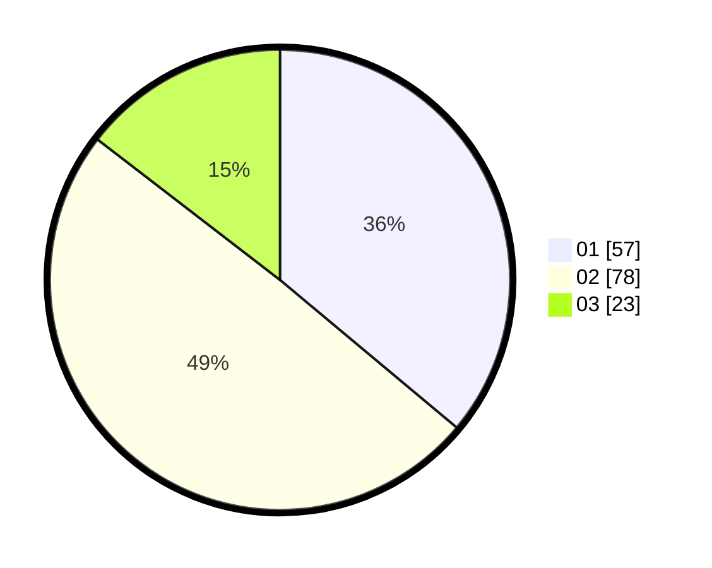

# Hasil

Hasil perolehan suara paslon dapat dilihat pada file paslon-01.txt, paslon-02.txt, dan paslon-03.txt.

Jika tidak ada, artinya data tersebut belum ada pada SIREKAP.

## Perolehan Suara

 * Paslon 01: **57**.
 * Paslon 02: **78**.
 * Paslon 03: **23**.

## Foto C Plano

https://sirekap-obj-formc.kpu.go.id/e3b2/pemilu/ppwp/31/71/07/10/02/3171071002067-20240214-205757--286a8231-43ec-4720-8534-abb6f79aae0f.jpg

https://sirekap-obj-formc.kpu.go.id/e3b2/pemilu/ppwp/31/71/07/10/02/3171071002067-20240214-205413--1c0662c4-93bf-4e2a-8a32-92a492ac1bdb.jpg

https://sirekap-obj-formc.kpu.go.id/e3b2/pemilu/ppwp/31/71/07/10/02/3171071002067-20240214-205506--7c503b54-adb2-4e82-a691-a64d3f1aaea6.jpg

## DATA PEMILIH TETAP

Jumlah pemilih dalam DPT: **0**.
 * L: **0**.
 * P: **0**.

## DATA PENGGUNA HAK PILIH

Jumlah pengguna hak pilih dalam DPT: **0**.
 * L: **0**.
 * P: **0**.

Jumlah pengguna hak pilih dalam DPTb: **0**.
 * L: **0**.
 * P: **0**.

Jumlah pengguna hak pilih dalam DPK: **0**.
 * L: **0**.
 * P: **0**.

Jumlah pengguna hak pilih: **0**.
 * L: **0**.
 * P: **0**.

## JUMLAH SUARA SAH DAN TIDAK SAH

JUMLAH SELURUH SUARA SAH: **158**.

JUMLAH SUARA TIDAK SAH: **2**.

JUMLAH SELURUH SUARA SAH DAN SUARA TIDAK SAH: **160**.
