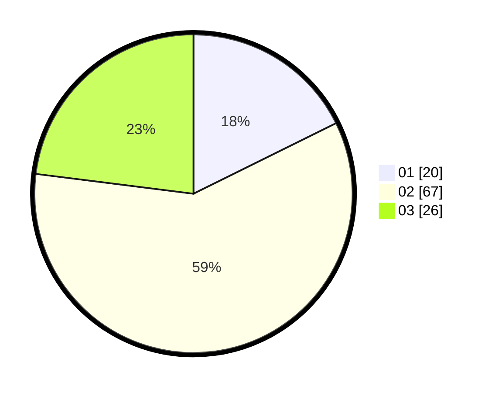

# Hasil

Hasil perolehan suara paslon dapat dilihat pada file paslon-01.txt, paslon-02.txt, dan paslon-03.txt.

Jika tidak ada, artinya data tersebut belum ada pada SIREKAP.

## Perolehan Suara

 * Paslon 01: **20**.
 * Paslon 02: **67**.
 * Paslon 03: **26**.

## Foto C Plano

https://sirekap-obj-formc.kpu.go.id/d255/pemilu/ppwp/31/71/07/10/02/3171071002071-20240214-200946--3c98cc09-1f9d-49f8-97a2-0b04bf1728c9.jpg

https://sirekap-obj-formc.kpu.go.id/d255/pemilu/ppwp/31/71/07/10/02/3171071002071-20240214-162225--3f85cab0-cb7f-4189-93b3-7b77c5dda673.jpg

https://sirekap-obj-formc.kpu.go.id/d255/pemilu/ppwp/31/71/07/10/02/3171071002071-20240214-201003--3a6022b5-70f6-4f1d-bbba-8b8b9bc17860.jpg

## DATA PEMILIH TETAP

Jumlah pemilih dalam DPT: **192**.
 * L: **94**.
 * P: **98**.

## DATA PENGGUNA HAK PILIH

Jumlah pengguna hak pilih dalam DPT: **106**.
 * L: **50**.
 * P: **56**.

Jumlah pengguna hak pilih dalam DPTb: **7**.
 * L: **4**.
 * P: **3**.

Jumlah pengguna hak pilih dalam DPK: **3**.
 * L: **1**.
 * P: **2**.

Jumlah pengguna hak pilih: **116**.
 * L: **55**.
 * P: **61**.

## JUMLAH SUARA SAH DAN TIDAK SAH

JUMLAH SELURUH SUARA SAH: **113**.

JUMLAH SUARA TIDAK SAH: **3**.

JUMLAH SELURUH SUARA SAH DAN SUARA TIDAK SAH: **116**.
