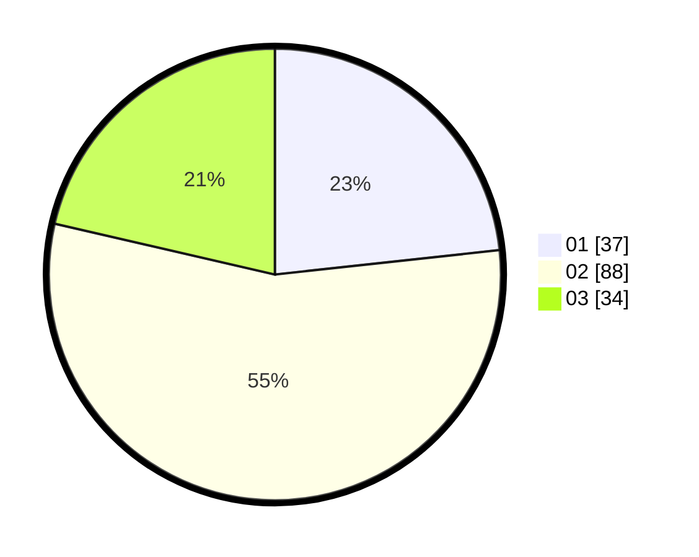

# Hasil

Hasil perolehan suara paslon dapat dilihat pada file paslon-01.txt, paslon-02.txt, dan paslon-03.txt.

Jika tidak ada, artinya data tersebut belum ada pada SIREKAP.

## Perolehan Suara

 * Paslon 01: **37**.
 * Paslon 02: **88**.
 * Paslon 03: **34**.

## Foto C Plano

https://sirekap-obj-formc.kpu.go.id/19b3/pemilu/ppwp/31/71/07/10/02/3171071002075-20240214-214607--96d53026-e270-4dae-a770-47557bf659cd.jpg

https://sirekap-obj-formc.kpu.go.id/19b3/pemilu/ppwp/31/71/07/10/02/3171071002075-20240214-203101--a0505312-1a4e-4389-accf-539276eca110.jpg

https://sirekap-obj-formc.kpu.go.id/19b3/pemilu/ppwp/31/71/07/10/02/3171071002075-20240214-214456--5d37b090-312f-481f-b653-beed1c722683.jpg

## DATA PEMILIH TETAP

Jumlah pemilih dalam DPT: **199**.
 * L: **104**.
 * P: **95**.

## DATA PENGGUNA HAK PILIH

Jumlah pengguna hak pilih dalam DPT: **123**.
 * L: **66**.
 * P: **57**.

Jumlah pengguna hak pilih dalam DPTb: **15**.
 * L: **4**.
 * P: **11**.

Jumlah pengguna hak pilih dalam DPK: **26**.
 * L: **16**.
 * P: **10**.

Jumlah pengguna hak pilih: **164**.
 * L: **86**.
 * P: **78**.

## JUMLAH SUARA SAH DAN TIDAK SAH

JUMLAH SELURUH SUARA SAH: **159**.

JUMLAH SUARA TIDAK SAH: **5**.

JUMLAH SELURUH SUARA SAH DAN SUARA TIDAK SAH: **164**.
