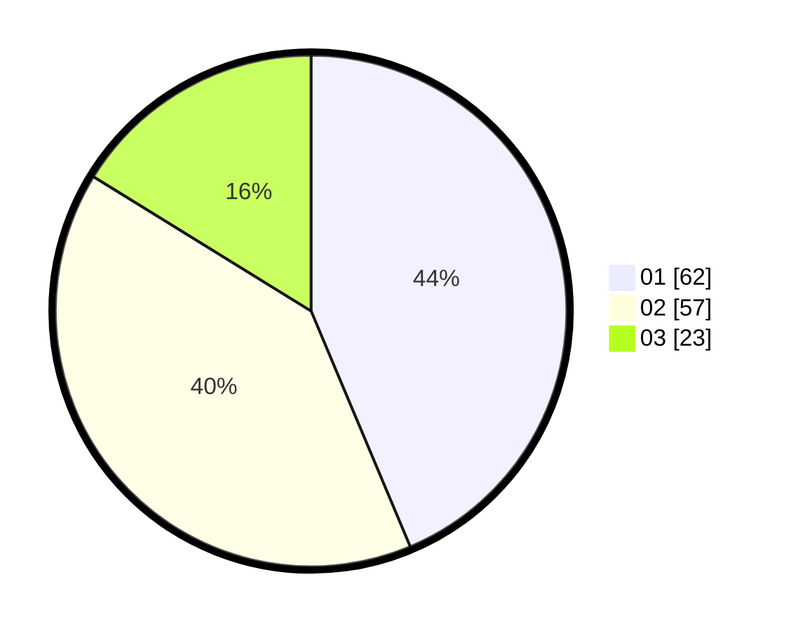

# Hasil

Hasil perolehan suara paslon dapat dilihat pada file paslon-01.txt, paslon-02.txt, dan paslon-03.txt.

Jika tidak ada, artinya data tersebut belum ada pada SIREKAP.

## Perolehan Suara

 * Paslon 01: **62**.
 * Paslon 02: **57**.
 * Paslon 03: **23**.

## Foto C Plano

https://sirekap-obj-formc.kpu.go.id/111b/pemilu/ppwp/31/71/07/10/03/3171071003006-20240214-184944--f32ebcda-cf5d-44e4-b5e0-f3291005f432.jpg

https://sirekap-obj-formc.kpu.go.id/111b/pemilu/ppwp/31/71/07/10/03/3171071003006-20240214-185001--23e99591-da58-4d7a-83a5-051dde0cafb5.jpg

https://sirekap-obj-formc.kpu.go.id/111b/pemilu/ppwp/31/71/07/10/03/3171071003006-20240214-185017--63f22a8f-841a-45d4-9690-5f394ffe04b8.jpg
