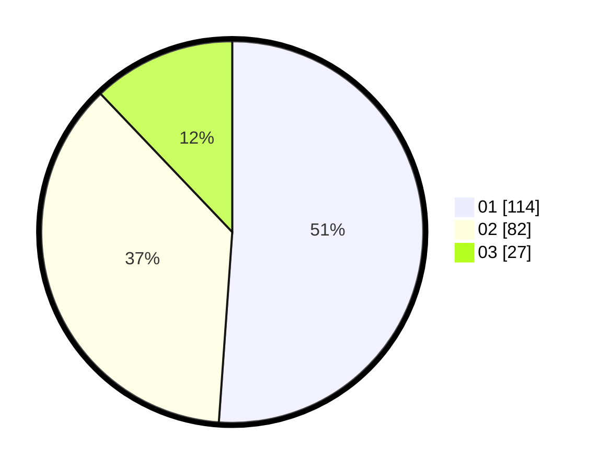

# Hasil

Hasil perolehan suara paslon dapat dilihat pada file paslon-01.txt, paslon-02.txt, dan paslon-03.txt.

Jika tidak ada, artinya data tersebut belum ada pada SIREKAP.

## Perolehan Suara

 * Paslon 01: **114**.
 * Paslon 02: **82**.
 * Paslon 03: **27**.

## Foto C Plano

https://sirekap-obj-formc.kpu.go.id/02f5/pemilu/ppwp/31/71/07/10/03/3171071003010-20240216-222715--10316320-3310-408a-8768-62918f5555e8.jpg

https://sirekap-obj-formc.kpu.go.id/02f5/pemilu/ppwp/31/71/07/10/03/3171071003010-20240216-222716--038664e0-b67b-4d05-8036-c5303065b291.jpg

https://sirekap-obj-formc.kpu.go.id/02f5/pemilu/ppwp/31/71/07/10/03/3171071003010-20240216-222715--df8bcc4a-e8c3-443d-a740-e203e7612de7.jpg

## DATA PEMILIH TETAP

Jumlah pemilih dalam DPT: **0**.
 * L: **0**.
 * P: **0**.

## DATA PENGGUNA HAK PILIH

Jumlah pengguna hak pilih dalam DPT: **0**.
 * L: **0**.
 * P: **0**.

Jumlah pengguna hak pilih dalam DPTb: **0**.
 * L: **0**.
 * P: **0**.

Jumlah pengguna hak pilih dalam DPK: **0**.
 * L: **0**.
 * P: **0**.

Jumlah pengguna hak pilih: **0**.
 * L: **0**.
 * P: **0**.

## JUMLAH SUARA SAH DAN TIDAK SAH

JUMLAH SELURUH SUARA SAH: **223**.

JUMLAH SUARA TIDAK SAH: **10**.

JUMLAH SELURUH SUARA SAH DAN SUARA TIDAK SAH: **233**.
