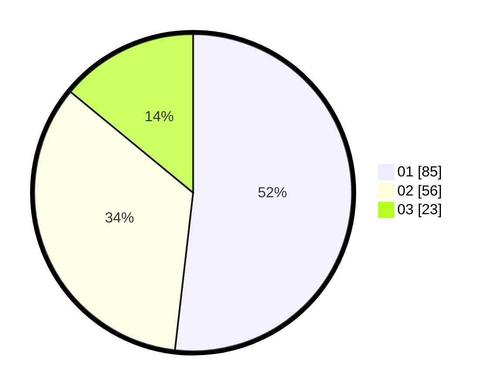

# Hasil

Hasil perolehan suara paslon dapat dilihat pada file paslon-01.txt, paslon-02.txt, dan paslon-03.txt.

Jika tidak ada, artinya data tersebut belum ada pada SIREKAP.

## Perolehan Suara

 * Paslon 01: **85**.
 * Paslon 02: **56**.
 * Paslon 03: **23**.

## Foto C Plano

https://sirekap-obj-formc.kpu.go.id/6892/pemilu/ppwp/31/71/07/10/03/3171071003013-20240214-195026--d244398e-f0cd-4d8d-aff5-195286a3d5ba.jpg

https://sirekap-obj-formc.kpu.go.id/6892/pemilu/ppwp/31/71/07/10/03/3171071003013-20240214-195303--107e036f-7cb8-446d-9c9b-ed5f6abd1883.jpg

https://sirekap-obj-formc.kpu.go.id/6892/pemilu/ppwp/31/71/07/10/03/3171071003013-20240214-200722--136ad3fc-2e2b-4975-9891-16e3f69939b8.jpg

## DATA PEMILIH TETAP

Jumlah pemilih dalam DPT: **193**.
 * L: **104**.
 * P: **89**.

## DATA PENGGUNA HAK PILIH

Jumlah pengguna hak pilih dalam DPT: **168**.
 * L: **93**.
 * P: **75**.

Jumlah pengguna hak pilih dalam DPTb: **0**.
 * L: **0**.
 * P: **0**.

Jumlah pengguna hak pilih dalam DPK: **0**.
 * L: **0**.
 * P: **0**.

Jumlah pengguna hak pilih: **168**.
 * L: **93**.
 * P: **75**.

## JUMLAH SUARA SAH DAN TIDAK SAH

JUMLAH SELURUH SUARA SAH: **164**.

JUMLAH SUARA TIDAK SAH: **4**.

JUMLAH SELURUH SUARA SAH DAN SUARA TIDAK SAH: **168**.
