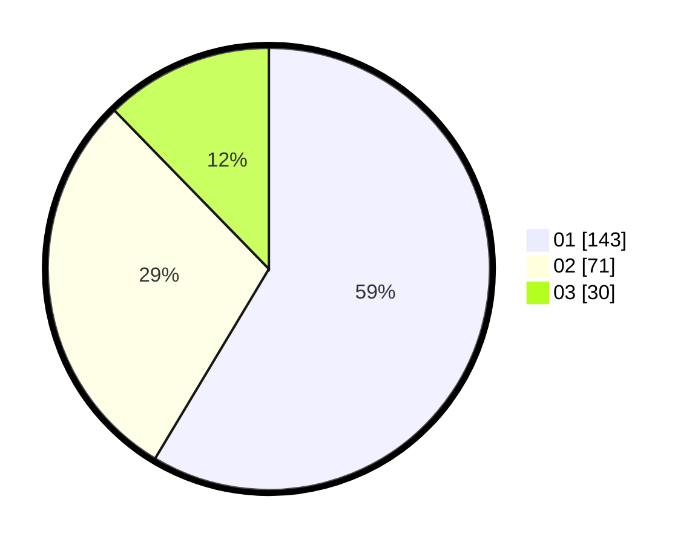

# Hasil

Hasil perolehan suara paslon dapat dilihat pada file paslon-01.txt, paslon-02.txt, dan paslon-03.txt.

Jika tidak ada, artinya data tersebut belum ada pada SIREKAP.

## Perolehan Suara

 * Paslon 01: **143**.
 * Paslon 02: **71**.
 * Paslon 03: **30**.

## Foto C Plano

https://sirekap-obj-formc.kpu.go.id/eb9b/pemilu/ppwp/31/71/07/10/03/3171071003015-20240215-003432--2ca6b105-b1d9-42e7-b2f3-fb0f144ac5d7.jpg

https://sirekap-obj-formc.kpu.go.id/eb9b/pemilu/ppwp/31/71/07/10/03/3171071003015-20240215-003527--1f83f474-4f73-45b1-aa8d-79d2723c463c.jpg

https://sirekap-obj-formc.kpu.go.id/eb9b/pemilu/ppwp/31/71/07/10/03/3171071003015-20240215-003813--e762798e-d733-4d3a-a5d9-4f2c5be18296.jpg

## DATA PEMILIH TETAP

Jumlah pemilih dalam DPT: **276**.
 * L: **135**.
 * P: **141**.

## DATA PENGGUNA HAK PILIH

Jumlah pengguna hak pilih dalam DPT: **241**.
 * L: **118**.
 * P: **123**.

Jumlah pengguna hak pilih dalam DPTb: **2**.
 * L: **1**.
 * P: **1**.

Jumlah pengguna hak pilih dalam DPK: **1**.
 * L: **1**.
 * P: **0**.

Jumlah pengguna hak pilih: **244**.
 * L: **0**.
 * P: **0**.

## JUMLAH SUARA SAH DAN TIDAK SAH

JUMLAH SELURUH SUARA SAH: **244**.

JUMLAH SUARA TIDAK SAH: **0**.

JUMLAH SELURUH SUARA SAH DAN SUARA TIDAK SAH: **244**.
