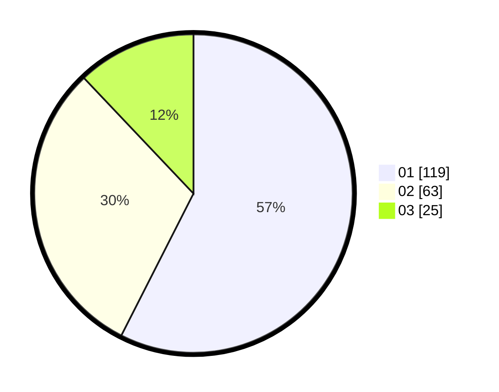

# Hasil

Hasil perolehan suara paslon dapat dilihat pada file paslon-01.txt, paslon-02.txt, dan paslon-03.txt.

Jika tidak ada, artinya data tersebut belum ada pada SIREKAP.

## Perolehan Suara

 * Paslon 01: **119**.
 * Paslon 02: **63**.
 * Paslon 03: **25**.

## Foto C Plano

https://sirekap-obj-formc.kpu.go.id/37e5/pemilu/ppwp/31/71/07/10/03/3171071003022-20240214-160100--38280f8a-ca8b-4da2-92f0-b48120f71fc5.jpg

https://sirekap-obj-formc.kpu.go.id/37e5/pemilu/ppwp/31/71/07/10/03/3171071003022-20240214-160149--5582c25d-042a-4751-a41b-eae501ea45a1.jpg

https://sirekap-obj-formc.kpu.go.id/37e5/pemilu/ppwp/31/71/07/10/03/3171071003022-20240214-175442--e04d05fa-d6f1-4f69-8f4e-9c2d1eb170c5.jpg

## DATA PEMILIH TETAP

Jumlah pemilih dalam DPT: **258**.
 * L: **128**.
 * P: **130**.

## DATA PENGGUNA HAK PILIH

Jumlah pengguna hak pilih dalam DPT: **205**.
 * L: **100**.
 * P: **105**.

Jumlah pengguna hak pilih dalam DPTb: **1**.
 * L: **0**.
 * P: **1**.

Jumlah pengguna hak pilih dalam DPK: **3**.
 * L: **3**.
 * P: **0**.

Jumlah pengguna hak pilih: **209**.
 * L: **103**.
 * P: **106**.

## JUMLAH SUARA SAH DAN TIDAK SAH

JUMLAH SELURUH SUARA SAH: **207**.

JUMLAH SUARA TIDAK SAH: **2**.

JUMLAH SELURUH SUARA SAH DAN SUARA TIDAK SAH: **209**.
