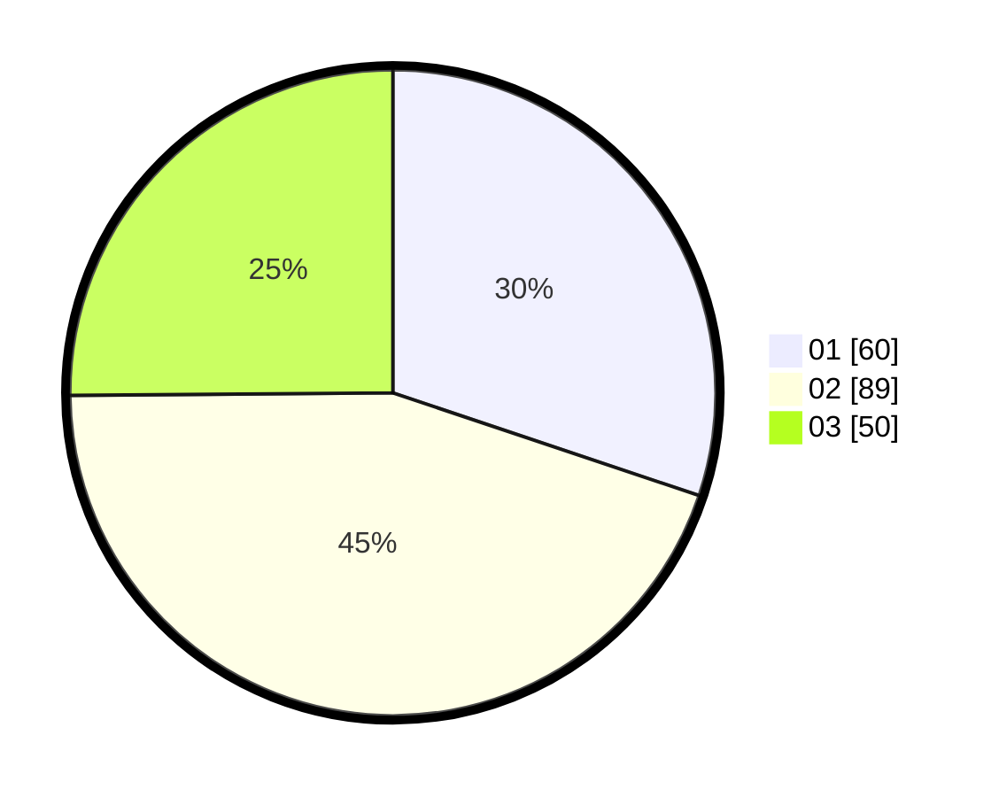

# Hasil

Hasil perolehan suara paslon dapat dilihat pada file paslon-01.txt, paslon-02.txt, dan paslon-03.txt.

Jika tidak ada, artinya data tersebut belum ada pada SIREKAP.

## Perolehan Suara

 * Paslon 01: **60**.
 * Paslon 02: **89**.
 * Paslon 03: **50**.

## Foto C Plano

https://sirekap-obj-formc.kpu.go.id/5c5d/pemilu/ppwp/31/71/07/10/03/3171071003027-20240214-155619--c155988c-e797-4d46-aa9f-2c88fb5ee38c.jpg

https://sirekap-obj-formc.kpu.go.id/5c5d/pemilu/ppwp/31/71/07/10/03/3171071003027-20240214-155727--dfe4a847-3456-4411-997d-9b0a892cc879.jpg

https://sirekap-obj-formc.kpu.go.id/5c5d/pemilu/ppwp/31/71/07/10/03/3171071003027-20240214-155819--21d5c026-cd1b-4b8a-a486-c44c214f6db8.jpg

## DATA PEMILIH TETAP

Jumlah pemilih dalam DPT: **264**.
 * L: **133**.
 * P: **131**.

## DATA PENGGUNA HAK PILIH

Jumlah pengguna hak pilih dalam DPT: **204**.
 * L: **100**.
 * P: **104**.

Jumlah pengguna hak pilih dalam DPTb: **0**.
 * L: **0**.
 * P: **0**.

Jumlah pengguna hak pilih dalam DPK: **2**.
 * L: **0**.
 * P: **2**.

Jumlah pengguna hak pilih: **206**.
 * L: **100**.
 * P: **106**.

## JUMLAH SUARA SAH DAN TIDAK SAH

JUMLAH SELURUH SUARA SAH: **199**.

JUMLAH SUARA TIDAK SAH: **7**.

JUMLAH SELURUH SUARA SAH DAN SUARA TIDAK SAH: **206**.
