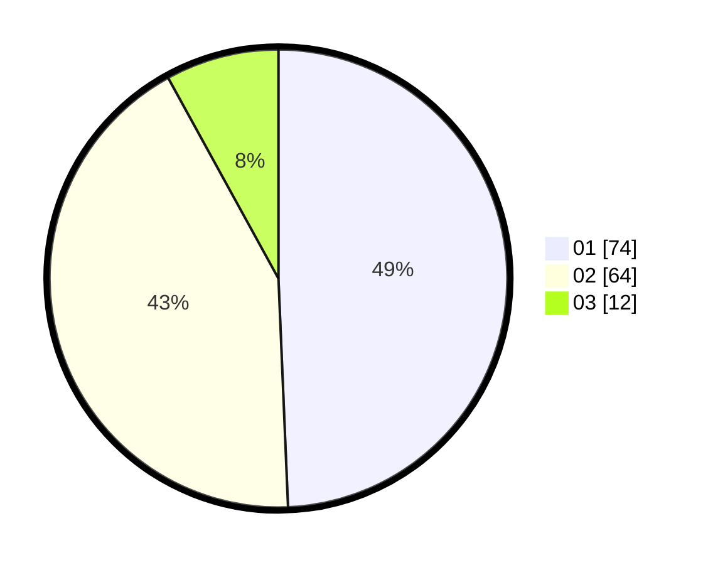

# Hasil

Hasil perolehan suara paslon dapat dilihat pada file paslon-01.txt, paslon-02.txt, dan paslon-03.txt.

Jika tidak ada, artinya data tersebut belum ada pada SIREKAP.

## Perolehan Suara

 * Paslon 01: **74**.
 * Paslon 02: **64**.
 * Paslon 03: **12**.

## Foto C Plano

https://sirekap-obj-formc.kpu.go.id/7d3c/pemilu/ppwp/31/71/07/10/03/3171071003028-20240216-052315--eedaeca5-885b-4342-a801-1f40ee2d43b4.jpg

https://sirekap-obj-formc.kpu.go.id/7d3c/pemilu/ppwp/31/71/07/10/03/3171071003028-20240216-052331--b9705a05-e960-4e77-af49-02b7425d3c74.jpg

https://sirekap-obj-formc.kpu.go.id/7d3c/pemilu/ppwp/31/71/07/10/03/3171071003028-20240216-052323--add6af0a-962f-40e8-a549-a1137cc114ff.jpg

## DATA PEMILIH TETAP

Jumlah pemilih dalam DPT: **185**.
 * L: **96**.
 * P: **89**.

## DATA PENGGUNA HAK PILIH

Jumlah pengguna hak pilih dalam DPT: **151**.
 * L: **73**.
 * P: **78**.

Jumlah pengguna hak pilih dalam DPTb: **1**.
 * L: **0**.
 * P: **1**.

Jumlah pengguna hak pilih dalam DPK: **0**.
 * L: **0**.
 * P: **0**.

Jumlah pengguna hak pilih: **152**.
 * L: **73**.
 * P: **79**.

## JUMLAH SUARA SAH DAN TIDAK SAH

JUMLAH SELURUH SUARA SAH: **150**.

JUMLAH SUARA TIDAK SAH: **2**.

JUMLAH SELURUH SUARA SAH DAN SUARA TIDAK SAH: **152**.
