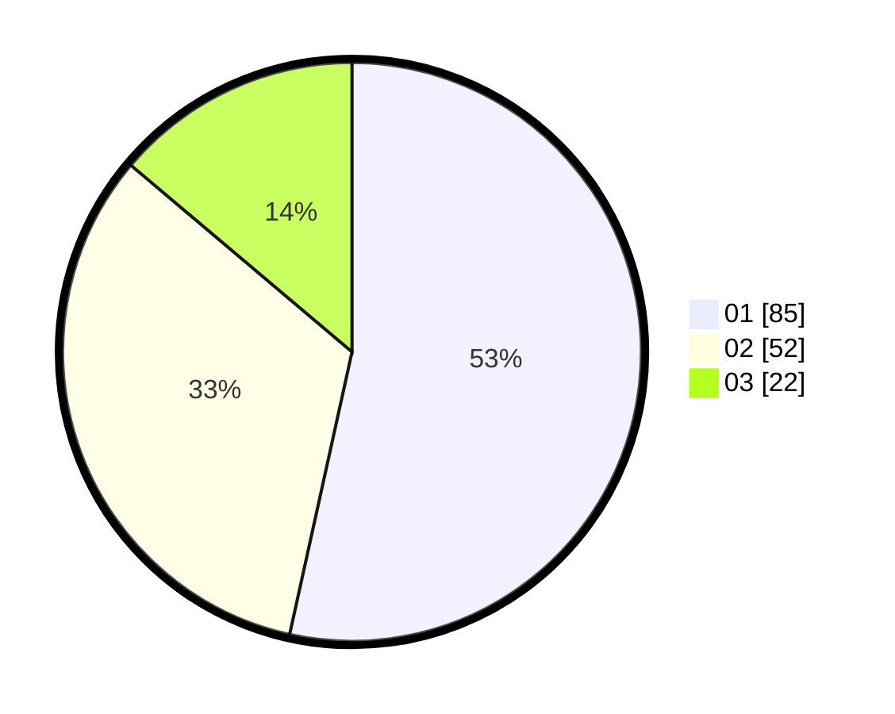

# Hasil

Hasil perolehan suara paslon dapat dilihat pada file paslon-01.txt, paslon-02.txt, dan paslon-03.txt.

Jika tidak ada, artinya data tersebut belum ada pada SIREKAP.

## Perolehan Suara

 * Paslon 01: **85**.
 * Paslon 02: **52**.
 * Paslon 03: **22**.

## Foto C Plano

https://sirekap-obj-formc.kpu.go.id/d24a/pemilu/ppwp/31/71/07/10/03/3171071003036-20240214-231523--59214e0e-b0d9-46e1-ad81-600d94e806f1.jpg

https://sirekap-obj-formc.kpu.go.id/d24a/pemilu/ppwp/31/71/07/10/03/3171071003036-20240214-155229--92e26de2-dec0-46d4-bcf8-bd38542ec78c.jpg

https://sirekap-obj-formc.kpu.go.id/d24a/pemilu/ppwp/31/71/07/10/03/3171071003036-20240214-155109--e6eaf82a-e1db-4d89-916e-63831aad12cc.jpg

## DATA PEMILIH TETAP

Jumlah pemilih dalam DPT: **213**.
 * L: **106**.
 * P: **107**.

## DATA PENGGUNA HAK PILIH

Jumlah pengguna hak pilih dalam DPT: **159**.
 * L: **77**.
 * P: **82**.

Jumlah pengguna hak pilih dalam DPTb: **0**.
 * L: **0**.
 * P: **0**.

Jumlah pengguna hak pilih dalam DPK: **1**.
 * L: **1**.
 * P: **0**.

Jumlah pengguna hak pilih: **160**.
 * L: **0**.
 * P: **0**.

## JUMLAH SUARA SAH DAN TIDAK SAH

JUMLAH SELURUH SUARA SAH: **159**.

JUMLAH SUARA TIDAK SAH: **1**.

JUMLAH SELURUH SUARA SAH DAN SUARA TIDAK SAH: **160**.
