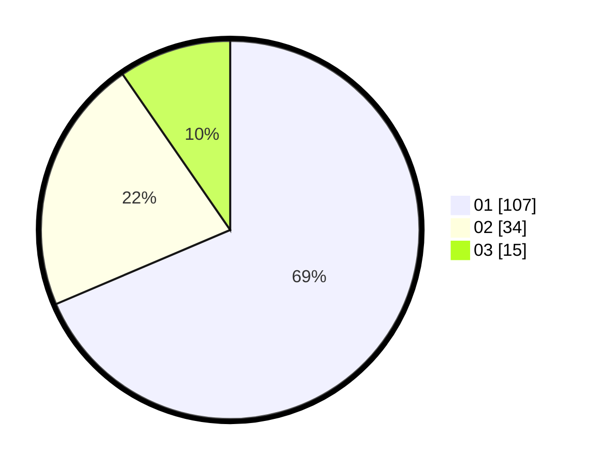

# Hasil

Hasil perolehan suara paslon dapat dilihat pada file paslon-01.txt, paslon-02.txt, dan paslon-03.txt.

Jika tidak ada, artinya data tersebut belum ada pada SIREKAP.

## Perolehan Suara

 * Paslon 01: **107**.
 * Paslon 02: **34**.
 * Paslon 03: **15**.

## Foto C Plano

https://sirekap-obj-formc.kpu.go.id/982b/pemilu/ppwp/31/71/07/10/03/3171071003037-20240215-224252--03b6c32d-36dc-454b-a9de-42e9eeb75ed5.jpg

https://sirekap-obj-formc.kpu.go.id/982b/pemilu/ppwp/31/71/07/10/03/3171071003037-20240215-224255--c657538b-aee6-41ac-a20e-1deb76f0ff90.jpg

https://sirekap-obj-formc.kpu.go.id/982b/pemilu/ppwp/31/71/07/10/03/3171071003037-20240215-224253--5427a636-cfe0-465e-b895-e16035d10a70.jpg

## DATA PEMILIH TETAP

Jumlah pemilih dalam DPT: **202**.
 * L: **113**.
 * P: **89**.

## DATA PENGGUNA HAK PILIH

Jumlah pengguna hak pilih dalam DPT: **154**.
 * L: **88**.
 * P: **66**.

Jumlah pengguna hak pilih dalam DPTb: **0**.
 * L: **0**.
 * P: **0**.

Jumlah pengguna hak pilih dalam DPK: **4**.
 * L: **1**.
 * P: **3**.

Jumlah pengguna hak pilih: **158**.
 * L: **89**.
 * P: **69**.

## JUMLAH SUARA SAH DAN TIDAK SAH

JUMLAH SELURUH SUARA SAH: **156**.

JUMLAH SUARA TIDAK SAH: **2**.

JUMLAH SELURUH SUARA SAH DAN SUARA TIDAK SAH: **158**.
