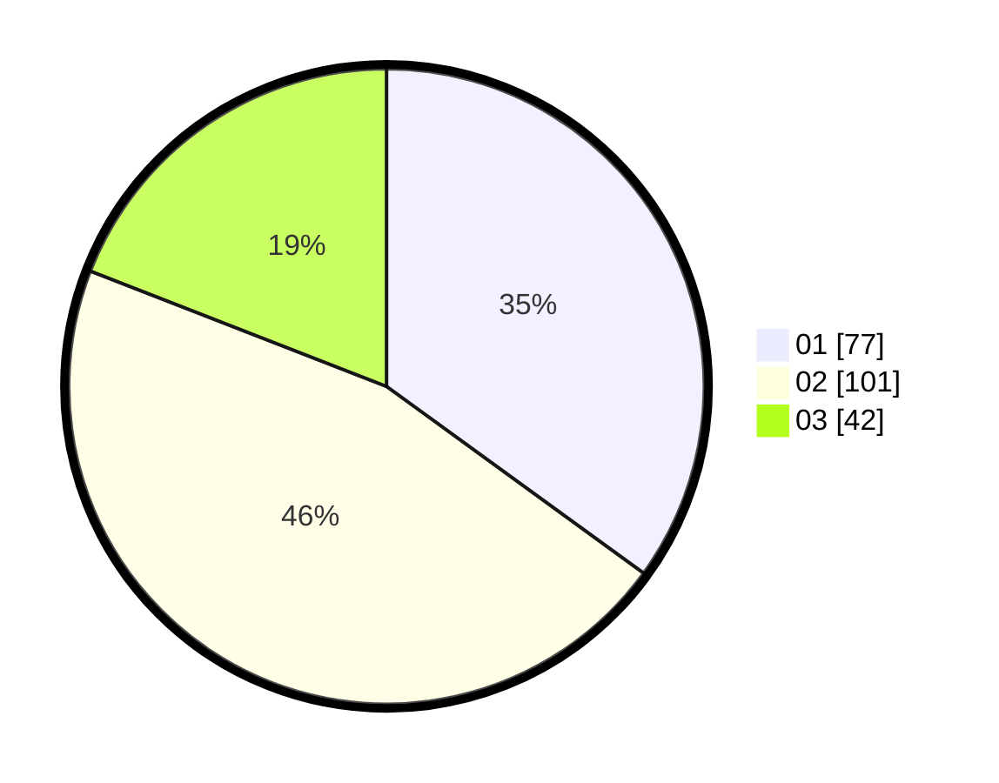

# Hasil

Hasil perolehan suara paslon dapat dilihat pada file paslon-01.txt, paslon-02.txt, dan paslon-03.txt.

Jika tidak ada, artinya data tersebut belum ada pada SIREKAP.

## Perolehan Suara

 * Paslon 01: **77**.
 * Paslon 02: **101**.
 * Paslon 03: **42**.

## Foto C Plano

https://sirekap-obj-formc.kpu.go.id/5808/pemilu/ppwp/31/71/07/10/03/3171071003041-20240214-213649--68d21cd3-67fa-4217-be45-fb3407901384.jpg

https://sirekap-obj-formc.kpu.go.id/5808/pemilu/ppwp/31/71/07/10/03/3171071003041-20240214-214158--07f5a2b4-959a-4c48-b1c1-3f49e50aa2c2.jpg

https://sirekap-obj-formc.kpu.go.id/5808/pemilu/ppwp/31/71/07/10/03/3171071003041-20240214-214628--f843226c-0fef-47b3-aedd-12646bcd5d1b.jpg

## DATA PEMILIH TETAP

Jumlah pemilih dalam DPT: **273**.
 * L: **146**.
 * P: **127**.

## DATA PENGGUNA HAK PILIH

Jumlah pengguna hak pilih dalam DPT: **221**.
 * L: **119**.
 * P: **102**.

Jumlah pengguna hak pilih dalam DPTb: **1**.
 * L: **1**.
 * P: **0**.

Jumlah pengguna hak pilih dalam DPK: **0**.
 * L: **0**.
 * P: **0**.

Jumlah pengguna hak pilih: **222**.
 * L: **120**.
 * P: **102**.

## JUMLAH SUARA SAH DAN TIDAK SAH

JUMLAH SELURUH SUARA SAH: **220**.

JUMLAH SUARA TIDAK SAH: **2**.

JUMLAH SELURUH SUARA SAH DAN SUARA TIDAK SAH: **222**.
