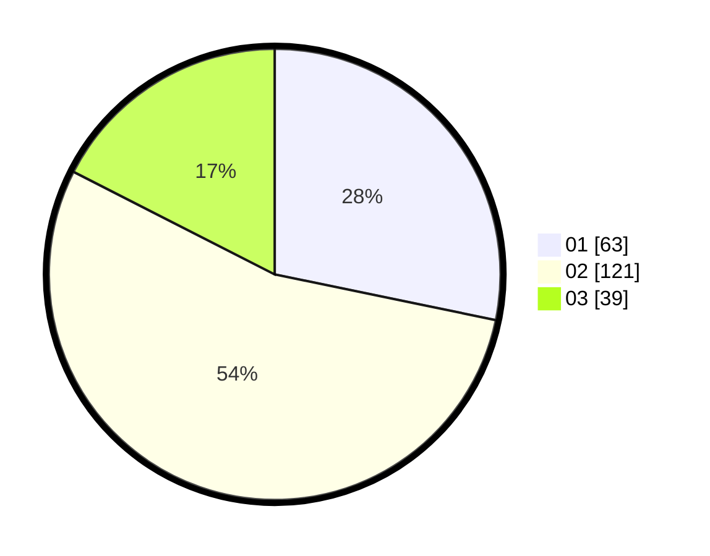

# Hasil

Hasil perolehan suara paslon dapat dilihat pada file paslon-01.txt, paslon-02.txt, dan paslon-03.txt.

Jika tidak ada, artinya data tersebut belum ada pada SIREKAP.

## Perolehan Suara

 * Paslon 01: **63**.
 * Paslon 02: **121**.
 * Paslon 03: **39**.

## Foto C Plano

https://sirekap-obj-formc.kpu.go.id/a2a7/pemilu/ppwp/31/71/07/10/03/3171071003042-20240214-223204--e660bf2b-af13-4994-9f97-c5ff9c153d00.jpg

https://sirekap-obj-formc.kpu.go.id/a2a7/pemilu/ppwp/31/71/07/10/03/3171071003042-20240215-042942--e9cacc11-1666-4435-a2bc-d53fb07f5d57.jpg

https://sirekap-obj-formc.kpu.go.id/a2a7/pemilu/ppwp/31/71/07/10/03/3171071003042-20240215-043121--38f6ed46-f174-407b-a04c-3635b2532d8b.jpg

## DATA PEMILIH TETAP

Jumlah pemilih dalam DPT: **281**.
 * L: **139**.
 * P: **142**.

## DATA PENGGUNA HAK PILIH

Jumlah pengguna hak pilih dalam DPT: **225**.
 * L: **107**.
 * P: **118**.

Jumlah pengguna hak pilih dalam DPTb: **0**.
 * L: **0**.
 * P: **0**.

Jumlah pengguna hak pilih dalam DPK: **4**.
 * L: **2**.
 * P: **2**.

Jumlah pengguna hak pilih: **229**.
 * L: **109**.
 * P: **120**.

## JUMLAH SUARA SAH DAN TIDAK SAH

JUMLAH SELURUH SUARA SAH: **223**.

JUMLAH SUARA TIDAK SAH: **6**.

JUMLAH SELURUH SUARA SAH DAN SUARA TIDAK SAH: **229**.
