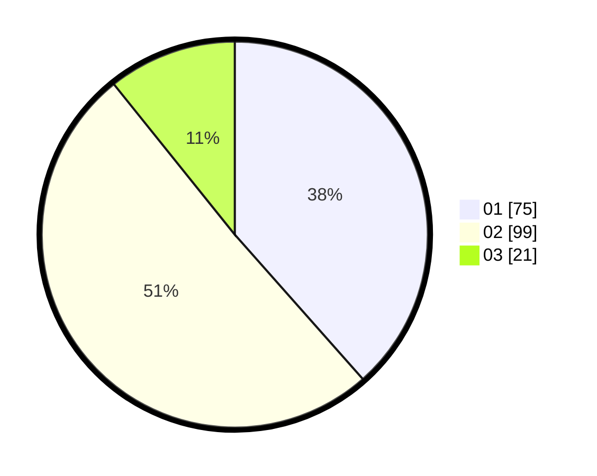

# Hasil

Hasil perolehan suara paslon dapat dilihat pada file paslon-01.txt, paslon-02.txt, dan paslon-03.txt.

Jika tidak ada, artinya data tersebut belum ada pada SIREKAP.

## Perolehan Suara

 * Paslon 01: **75**.
 * Paslon 02: **99**.
 * Paslon 03: **21**.

## Foto C Plano

https://sirekap-obj-formc.kpu.go.id/7d21/pemilu/ppwp/31/71/07/10/03/3171071003044-20240214-193216--92c8524b-80e3-4979-bfc7-af9523f0c81e.jpg

https://sirekap-obj-formc.kpu.go.id/7d21/pemilu/ppwp/31/71/07/10/03/3171071003044-20240214-225329--a0479751-c427-4353-b595-77956ee94189.jpg

https://sirekap-obj-formc.kpu.go.id/7d21/pemilu/ppwp/31/71/07/10/03/3171071003044-20240214-193617--f9f78dce-f5e0-4969-8653-67b59ac38eef.jpg

## DATA PEMILIH TETAP

Jumlah pemilih dalam DPT: **231**.
 * L: **119**.
 * P: **112**.

## DATA PENGGUNA HAK PILIH

Jumlah pengguna hak pilih dalam DPT: **199**.
 * L: **95**.
 * P: **104**.

Jumlah pengguna hak pilih dalam DPTb: **0**.
 * L: **0**.
 * P: **0**.

Jumlah pengguna hak pilih dalam DPK: **0**.
 * L: **0**.
 * P: **0**.

Jumlah pengguna hak pilih: **199**.
 * L: **95**.
 * P: **104**.

## JUMLAH SUARA SAH DAN TIDAK SAH

JUMLAH SELURUH SUARA SAH: **195**.

JUMLAH SUARA TIDAK SAH: **4**.

JUMLAH SELURUH SUARA SAH DAN SUARA TIDAK SAH: **199**.
