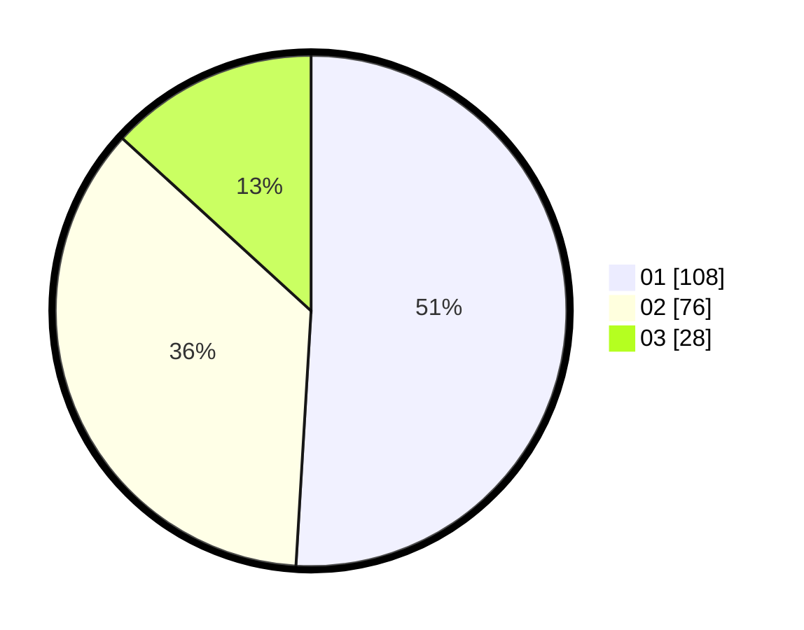

# Hasil

Hasil perolehan suara paslon dapat dilihat pada file paslon-01.txt, paslon-02.txt, dan paslon-03.txt.

Jika tidak ada, artinya data tersebut belum ada pada SIREKAP.

## Perolehan Suara

 * Paslon 01: **108**.
 * Paslon 02: **76**.
 * Paslon 03: **28**.

## Foto C Plano

https://sirekap-obj-formc.kpu.go.id/349c/pemilu/ppwp/31/71/07/10/03/3171071003045-20240214-235700--ff02d479-9fa2-4fc9-b9ed-595ad0c21f01.jpg

https://sirekap-obj-formc.kpu.go.id/349c/pemilu/ppwp/31/71/07/10/03/3171071003045-20240214-235923--38c73a86-a697-4c32-9715-04370ff3772b.jpg

https://sirekap-obj-formc.kpu.go.id/349c/pemilu/ppwp/31/71/07/10/03/3171071003045-20240215-000042--087b5e53-9456-40c0-8b8b-01e1912b760e.jpg

## DATA PEMILIH TETAP

Jumlah pemilih dalam DPT: **262**.
 * L: **125**.
 * P: **137**.

## DATA PENGGUNA HAK PILIH

Jumlah pengguna hak pilih dalam DPT: **213**.
 * L: **96**.
 * P: **117**.

Jumlah pengguna hak pilih dalam DPTb: **3**.
 * L: **0**.
 * P: **3**.

Jumlah pengguna hak pilih dalam DPK: **5**.
 * L: **2**.
 * P: **3**.

Jumlah pengguna hak pilih: **221**.
 * L: **98**.
 * P: **123**.

## JUMLAH SUARA SAH DAN TIDAK SAH

JUMLAH SELURUH SUARA SAH: **212**.

JUMLAH SUARA TIDAK SAH: **1**.

JUMLAH SELURUH SUARA SAH DAN SUARA TIDAK SAH: **213**.
