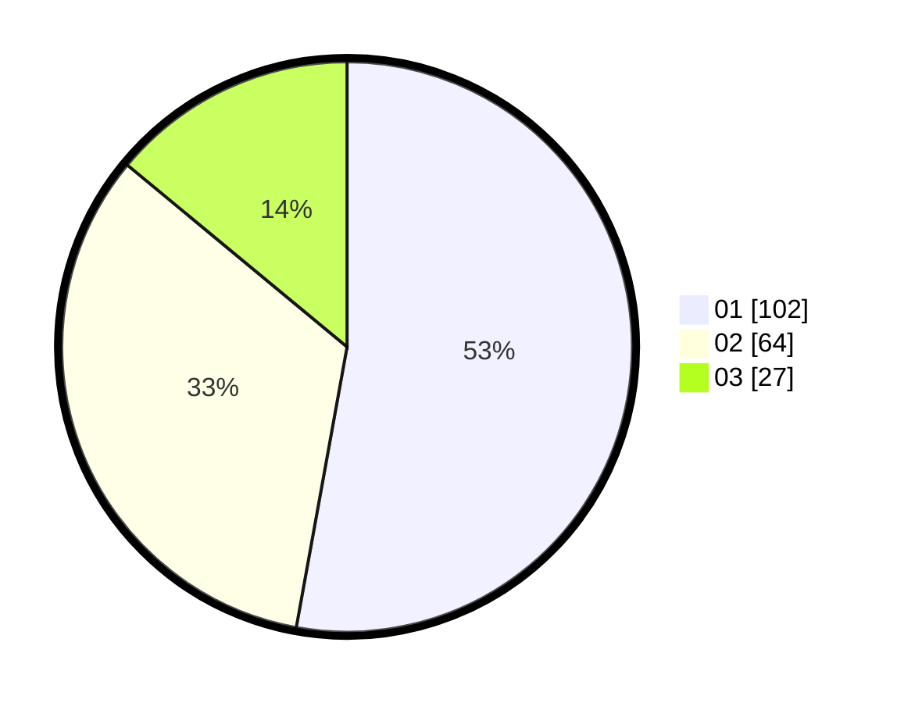

# Hasil

Hasil perolehan suara paslon dapat dilihat pada file paslon-01.txt, paslon-02.txt, dan paslon-03.txt.

Jika tidak ada, artinya data tersebut belum ada pada SIREKAP.

## Perolehan Suara

 * Paslon 01: **102**.
 * Paslon 02: **64**.
 * Paslon 03: **27**.

## Foto C Plano

https://sirekap-obj-formc.kpu.go.id/76b0/pemilu/ppwp/31/71/07/10/03/3171071003046-20240215-160149--fb87acbd-c6b1-46f9-bb61-11d2aadd33c0.jpg

https://sirekap-obj-formc.kpu.go.id/76b0/pemilu/ppwp/31/71/07/10/03/3171071003046-20240215-160752--78791a8e-0a1a-40b7-ac8e-3c5300ada17c.jpg

https://sirekap-obj-formc.kpu.go.id/76b0/pemilu/ppwp/31/71/07/10/03/3171071003046-20240214-194027--f6a57be4-a8d7-49bd-b7e2-3b3167170f9a.jpg

## DATA PEMILIH TETAP

Jumlah pemilih dalam DPT: **226**.
 * L: **112**.
 * P: **114**.

## DATA PENGGUNA HAK PILIH

Jumlah pengguna hak pilih dalam DPT: **192**.
 * L: **94**.
 * P: **98**.

Jumlah pengguna hak pilih dalam DPTb: **1**.
 * L: **1**.
 * P: **0**.

Jumlah pengguna hak pilih dalam DPK: **2**.
 * L: **1**.
 * P: **1**.

Jumlah pengguna hak pilih: **195**.
 * L: **96**.
 * P: **99**.

## JUMLAH SUARA SAH DAN TIDAK SAH

JUMLAH SELURUH SUARA SAH: **193**.

JUMLAH SUARA TIDAK SAH: **2**.

JUMLAH SELURUH SUARA SAH DAN SUARA TIDAK SAH: **195**.
