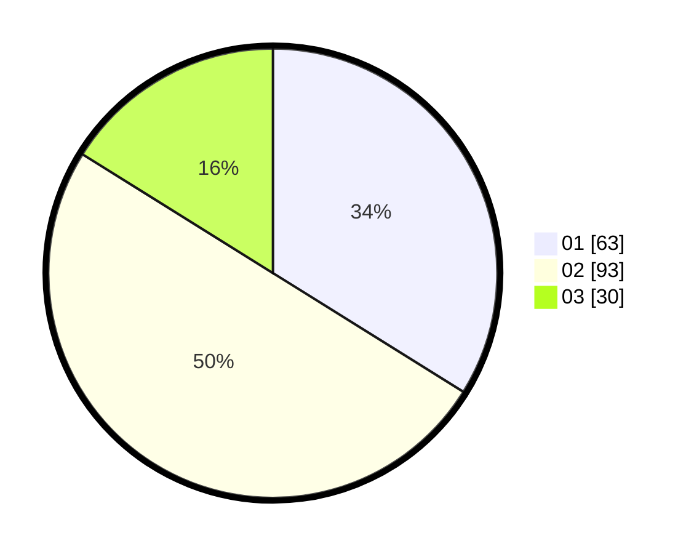

# Hasil

Hasil perolehan suara paslon dapat dilihat pada file paslon-01.txt, paslon-02.txt, dan paslon-03.txt.

Jika tidak ada, artinya data tersebut belum ada pada SIREKAP.

## Perolehan Suara

 * Paslon 01: **63**.
 * Paslon 02: **93**.
 * Paslon 03: **30**.

## Foto C Plano

https://sirekap-obj-formc.kpu.go.id/ae60/pemilu/ppwp/31/71/07/10/03/3171071003051-20240214-195138--322c37fe-51d8-478f-a9e4-f12fca5267cf.jpg

https://sirekap-obj-formc.kpu.go.id/ae60/pemilu/ppwp/31/71/07/10/03/3171071003051-20240214-193849--75fa9ca3-e14e-43ec-9aee-14f15617593a.jpg

https://sirekap-obj-formc.kpu.go.id/ae60/pemilu/ppwp/31/71/07/10/03/3171071003051-20240214-194046--0266f003-46cd-4253-8b5b-5b5df4f808a6.jpg

## DATA PEMILIH TETAP

Jumlah pemilih dalam DPT: **249**.
 * L: **123**.
 * P: **126**.

## DATA PENGGUNA HAK PILIH

Jumlah pengguna hak pilih dalam DPT: **189**.
 * L: **92**.
 * P: **97**.

Jumlah pengguna hak pilih dalam DPTb: **0**.
 * L: **0**.
 * P: **0**.

Jumlah pengguna hak pilih dalam DPK: **2**.
 * L: **1**.
 * P: **1**.

Jumlah pengguna hak pilih: **191**.
 * L: **93**.
 * P: **98**.

## JUMLAH SUARA SAH DAN TIDAK SAH

JUMLAH SELURUH SUARA SAH: **0**.

JUMLAH SUARA TIDAK SAH: **0**.

JUMLAH SELURUH SUARA SAH DAN SUARA TIDAK SAH: **0**.
