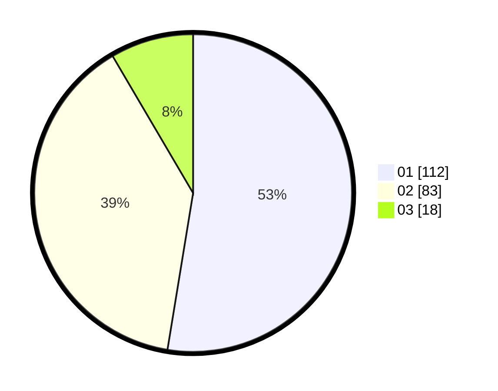

# Hasil

Hasil perolehan suara paslon dapat dilihat pada file paslon-01.txt, paslon-02.txt, dan paslon-03.txt.

Jika tidak ada, artinya data tersebut belum ada pada SIREKAP.

## Perolehan Suara

 * Paslon 01: **112**.
 * Paslon 02: **83**.
 * Paslon 03: **18**.

## Foto C Plano

https://sirekap-obj-formc.kpu.go.id/bf03/pemilu/ppwp/31/71/07/10/03/3171071003055-20240217-064047--b8b9c586-1fd7-45a0-96fb-9ed7e34cf7a0.jpg

https://sirekap-obj-formc.kpu.go.id/bf03/pemilu/ppwp/31/71/07/10/03/3171071003055-20240217-064048--364f5fd8-725b-48d0-a35a-fe24c56b39f3.jpg

https://sirekap-obj-formc.kpu.go.id/bf03/pemilu/ppwp/31/71/07/10/03/3171071003055-20240217-064047--c0f5d098-3319-4c06-bc40-f3f7c4a1329c.jpg

## DATA PEMILIH TETAP

Jumlah pemilih dalam DPT: **256**.
 * L: **138**.
 * P: **118**.

## DATA PENGGUNA HAK PILIH

Jumlah pengguna hak pilih dalam DPT: **210**.
 * L: **113**.
 * P: **97**.

Jumlah pengguna hak pilih dalam DPTb: **2**.
 * L: **1**.
 * P: **1**.

Jumlah pengguna hak pilih dalam DPK: **6**.
 * L: **3**.
 * P: **3**.

Jumlah pengguna hak pilih: **218**.
 * L: **117**.
 * P: **101**.

## JUMLAH SUARA SAH DAN TIDAK SAH

JUMLAH SELURUH SUARA SAH: **213**.

JUMLAH SUARA TIDAK SAH: **5**.

JUMLAH SELURUH SUARA SAH DAN SUARA TIDAK SAH: **218**.
