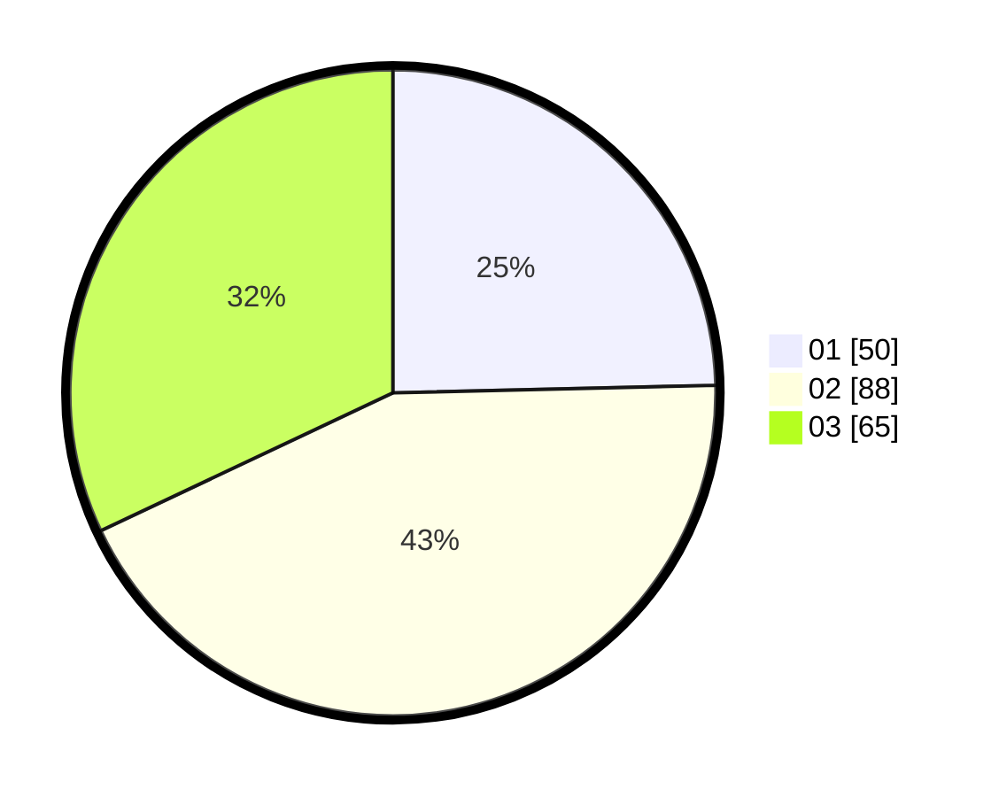

# Hasil

Hasil perolehan suara paslon dapat dilihat pada file paslon-01.txt, paslon-02.txt, dan paslon-03.txt.

Jika tidak ada, artinya data tersebut belum ada pada SIREKAP.

## Perolehan Suara

 * Paslon 01: **50**.
 * Paslon 02: **88**.
 * Paslon 03: **65**.

## Foto C Plano

https://sirekap-obj-formc.kpu.go.id/1a3a/pemilu/ppwp/31/71/07/10/03/3171071003061-20240214-223545--9d8734bf-faa9-4f24-a95e-ea1f94a92c6a.jpg

https://sirekap-obj-formc.kpu.go.id/1a3a/pemilu/ppwp/31/71/07/10/03/3171071003061-20240214-231927--57c29482-fa89-4229-8724-51a7ecb43704.jpg

https://sirekap-obj-formc.kpu.go.id/1a3a/pemilu/ppwp/31/71/07/10/03/3171071003061-20240214-232026--d4b7338f-404f-4560-90f1-d4d367b32465.jpg

## DATA PEMILIH TETAP

Jumlah pemilih dalam DPT: **267**.
 * L: **123**.
 * P: **144**.

## DATA PENGGUNA HAK PILIH

Jumlah pengguna hak pilih dalam DPT: **175**.
 * L: **81**.
 * P: **94**.

Jumlah pengguna hak pilih dalam DPTb: **13**.
 * L: **5**.
 * P: **8**.

Jumlah pengguna hak pilih dalam DPK: **17**.
 * L: **6**.
 * P: **11**.

Jumlah pengguna hak pilih: **205**.
 * L: **92**.
 * P: **113**.

## JUMLAH SUARA SAH DAN TIDAK SAH

JUMLAH SELURUH SUARA SAH: **203**.

JUMLAH SUARA TIDAK SAH: **2**.

JUMLAH SELURUH SUARA SAH DAN SUARA TIDAK SAH: **205**.
