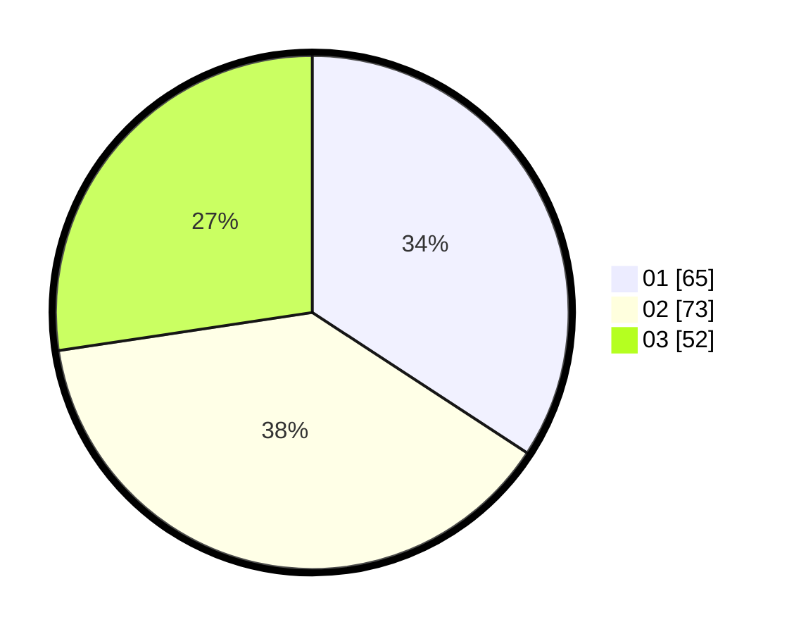

# Hasil

Hasil perolehan suara paslon dapat dilihat pada file paslon-01.txt, paslon-02.txt, dan paslon-03.txt.

Jika tidak ada, artinya data tersebut belum ada pada SIREKAP.

## Perolehan Suara

 * Paslon 01: **65**.
 * Paslon 02: **73**.
 * Paslon 03: **52**.

## Foto C Plano

https://sirekap-obj-formc.kpu.go.id/67ae/pemilu/ppwp/31/71/07/10/03/3171071003062-20240215-033428--e8ee3fef-20fa-4879-a4eb-553ef6a02684.jpg

https://sirekap-obj-formc.kpu.go.id/67ae/pemilu/ppwp/31/71/07/10/03/3171071003062-20240214-192440--02715d0b-fb5d-4558-9ded-9aaeed3c7ca8.jpg

https://sirekap-obj-formc.kpu.go.id/67ae/pemilu/ppwp/31/71/07/10/03/3171071003062-20240214-192538--71451f7a-87bd-49e3-b2ef-1b9bf934de37.jpg

## DATA PEMILIH TETAP

Jumlah pemilih dalam DPT: **267**.
 * L: **115**.
 * P: **152**.

## DATA PENGGUNA HAK PILIH

Jumlah pengguna hak pilih dalam DPT: **176**.
 * L: **74**.
 * P: **102**.

Jumlah pengguna hak pilih dalam DPTb: **1**.
 * L: **0**.
 * P: **1**.

Jumlah pengguna hak pilih dalam DPK: **6**.
 * L: **3**.
 * P: **3**.

Jumlah pengguna hak pilih: **184**.
 * L: **78**.
 * P: **106**.

## JUMLAH SUARA SAH DAN TIDAK SAH

JUMLAH SELURUH SUARA SAH: **190**.

JUMLAH SUARA TIDAK SAH: **6**.

JUMLAH SELURUH SUARA SAH DAN SUARA TIDAK SAH: **196**.
