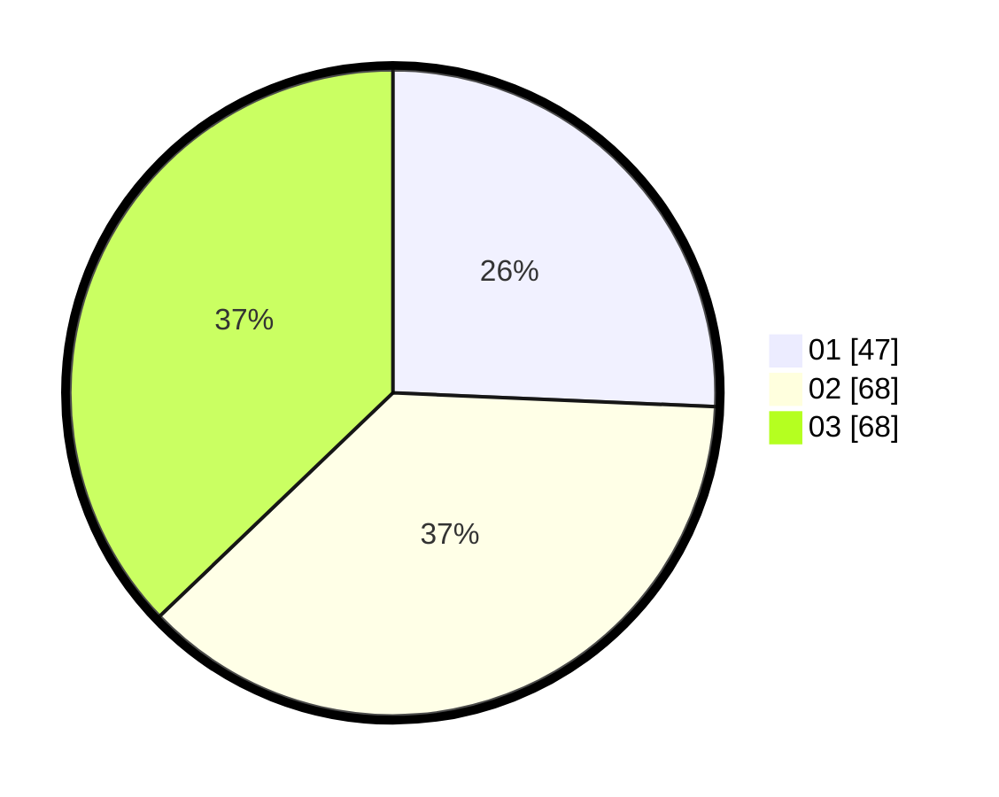

# Hasil

Hasil perolehan suara paslon dapat dilihat pada file paslon-01.txt, paslon-02.txt, dan paslon-03.txt.

Jika tidak ada, artinya data tersebut belum ada pada SIREKAP.

## Perolehan Suara

 * Paslon 01: **47**.
 * Paslon 02: **68**.
 * Paslon 03: **68**.

## Foto C Plano

https://sirekap-obj-formc.kpu.go.id/9bc0/pemilu/ppwp/31/71/07/10/03/3171071003063-20240214-231626--6d5efa07-aa9a-4799-b1ce-22f584086e1e.jpg

https://sirekap-obj-formc.kpu.go.id/9bc0/pemilu/ppwp/31/71/07/10/03/3171071003063-20240214-232308--87f2df8f-9cd2-4ac1-b6c0-8698de9225b3.jpg

https://sirekap-obj-formc.kpu.go.id/9bc0/pemilu/ppwp/31/71/07/10/03/3171071003063-20240214-222815--f33381af-9e59-45d8-9fb1-b1d709697d35.jpg

## DATA PEMILIH TETAP

Jumlah pemilih dalam DPT: **266**.
 * L: **124**.
 * P: **142**.

## DATA PENGGUNA HAK PILIH

Jumlah pengguna hak pilih dalam DPT: **175**.
 * L: **95**.
 * P: **80**.

Jumlah pengguna hak pilih dalam DPTb: **8**.
 * L: **1**.
 * P: **7**.

Jumlah pengguna hak pilih dalam DPK: **4**.
 * L: **1**.
 * P: **3**.

Jumlah pengguna hak pilih: **187**.
 * L: **97**.
 * P: **90**.

## JUMLAH SUARA SAH DAN TIDAK SAH

JUMLAH SELURUH SUARA SAH: **183**.

JUMLAH SUARA TIDAK SAH: **4**.

JUMLAH SELURUH SUARA SAH DAN SUARA TIDAK SAH: **187**.
