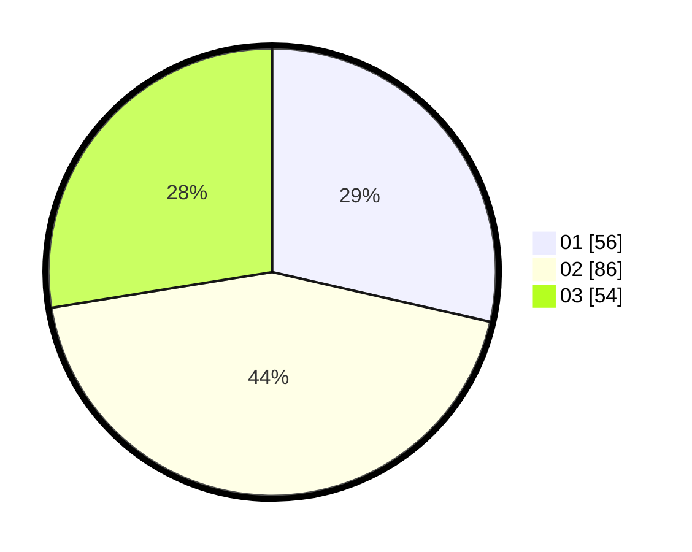

# Hasil

Hasil perolehan suara paslon dapat dilihat pada file paslon-01.txt, paslon-02.txt, dan paslon-03.txt.

Jika tidak ada, artinya data tersebut belum ada pada SIREKAP.

## Perolehan Suara

 * Paslon 01: **56**.
 * Paslon 02: **86**.
 * Paslon 03: **54**.

## Foto C Plano

https://sirekap-obj-formc.kpu.go.id/109d/pemilu/ppwp/31/71/07/10/03/3171071003069-20240214-201516--04f0e4ba-ca82-489b-93ef-334714d997bc.jpg

https://sirekap-obj-formc.kpu.go.id/109d/pemilu/ppwp/31/71/07/10/03/3171071003069-20240214-201610--94c2d80d-1625-4c34-80f6-4c1c48aa89d4.jpg
